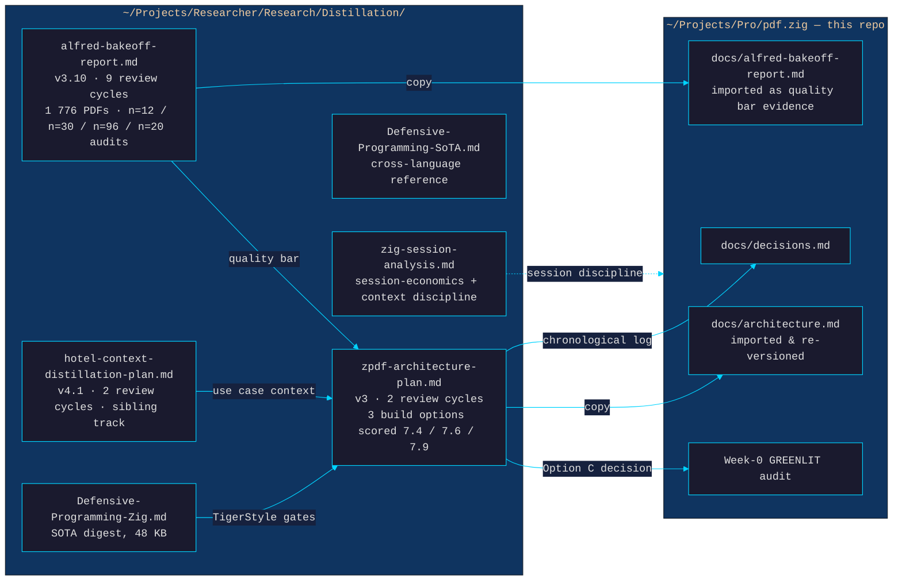
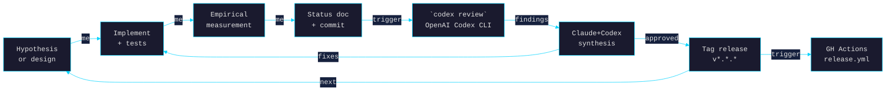
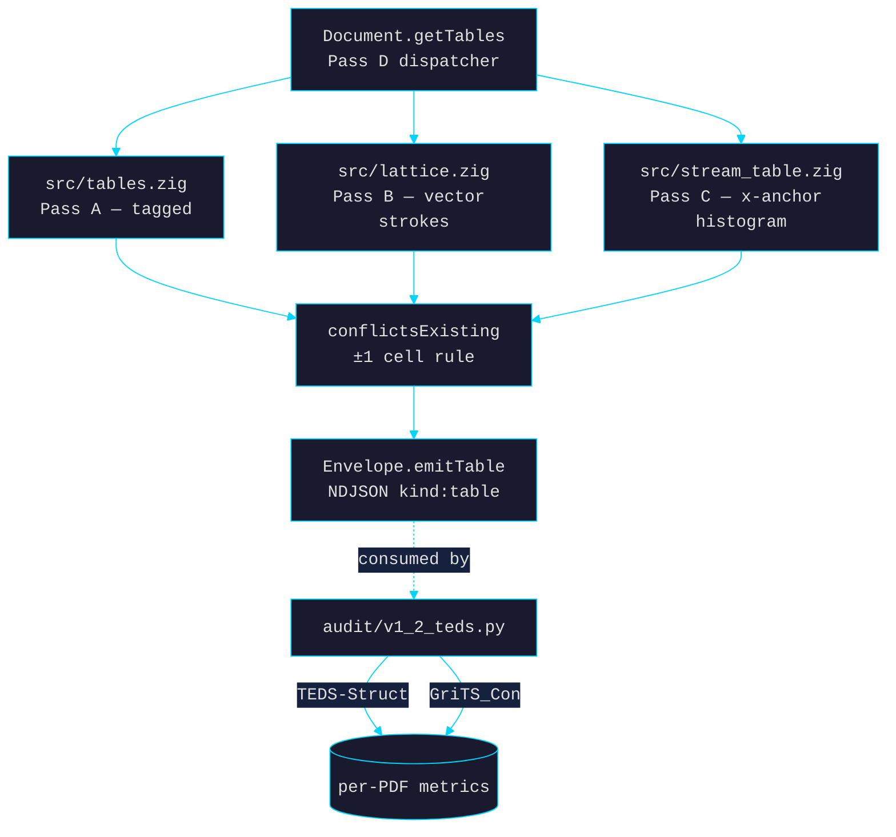
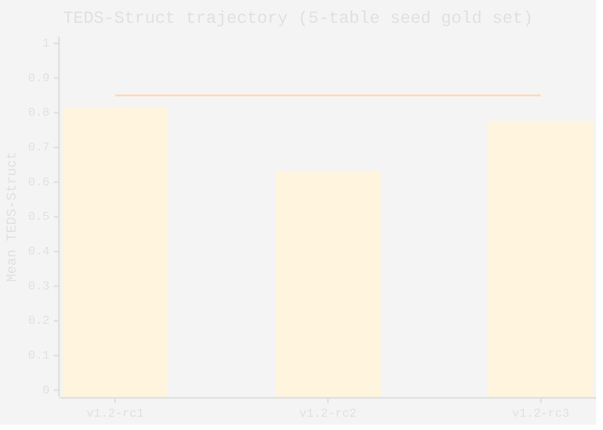
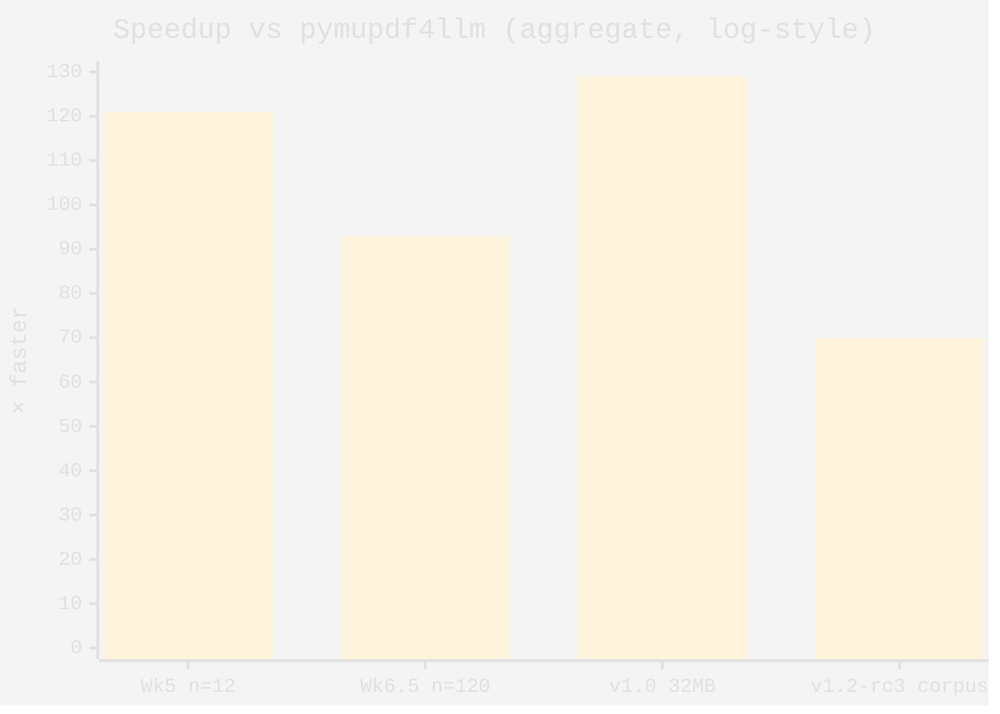
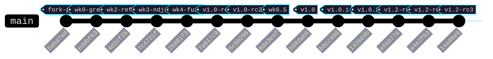

%% Inline Dataview fields (visible only when Dataview plugin is enabled) %%
release_count:: 9
review_cycles:: 13
speedup_n12:: 121
speedup_n120:: 92.9
rss_ratio:: 86
fuzz_targets:: 13
unit_tests:: 162
binary_kb:: 647
%% end inline metadata %%

> [!abstract] What this document is
> A complete, navigable log of every pdf.zig release from the Week-0 fork-greenlight (2026-04-26) through `v1.2-rc3` (2026-04-27): each tag, every commit, every tech choice, every Claude ↔ Codex review cycle, and the forward roadmap. Designed to be read in Obsidian — every release has its own section, every tech choice is its own block ref, every research moment links back to the artefact.

> [!success] Headline state
> 9 release tags, 13 weekly status docs + design docs, ~5 200 LOC of new Zig + ~3 500 LOC of Python audit harnesses + 162 unit tests + 13 fuzz targets at 1 M iters / week. 92.9× faster than `pymupdf4llm` aggregate at corpus scale, 86× smaller RSS. Live brew tap at `laurentfabre/pdf.zig`.

---

## 🔖 Checkpoint — 2026-05-04

> [!info]+ Resume-from-this-row state for a fresh Claude session
> If you're loading this project cold, this is what's true on `main` right now.

**Toolchain**: Zig 0.16.0 (default `zig` via ZVM at `~/.zvm/bin/zig`). 0.15.2 no longer compiles this tree. Sibling Pro/ projects (`ft/`, `c7/`, `Izabella/`, `ziglib/`) keep their own 0.15 pin via `/opt/homebrew/opt/zig@0.15/bin/zig`; pdf.zig is hermetically isolated (no `build.zig.zon`, no path imports). See AGENTS.md §Architecture/Native-Layer for the full toolchain note.

**Shipped since the v1.2-rc3 dossier above**:
- **PR-17** — `kind:"section"` long-PDF checkpoint records (#30-era; ticked).
- **PR-18** — citation-grade `--bboxes` flag (#30, ticked via #31).
- **PR-19** — image extraction. Three modes shipped: `--images` metadata-only (#35), `encoding` field surfaced from /Filter (#38), `--images=base64` payload (#39), `--images=path` file-extraction with safe filename derivation (#41); ticked via #42.
- **PR-20** — non-/Link annotation extraction (#33, ticked via #34).
- **PR-21** — PDF/UA structure-tree NDJSON output via `--struct-tree` (#36, ticked via #37).
- **0.16 migration** (#45) — all stdlib API drift handled across 25 source + 8 docs/CI files. 1378 → 1743 tests now passing on 0.16.
- **PR-W4** — FlateDecode content-stream compression (#47, ticked via #48). `DocumentBuilder.compress_content_streams = true` opts in; level-6 zlib-wrapped DEFLATE; 256 B threshold; 50 %+ size reduction on 3-page text PDFs.

**Also shipped 2026-05-03/04 — Bidi + CJK + roadmap-tick**:
- **#49 — PR-16 Bidi (UAX #9 Level-1)** (squash-merged): ~1051 LOC `src/bidi.zig` covering W1–W7, N1–N2, I1–I2, L1–L2. Wired into `Document.extractText` (and `extractAllText`, `extractTextFromFile`, `extractTextFromMemory`, capi, CLI, markdown renderer). Hebrew + Arabic synthesized fixtures via `testpdf.generateBidiPdf`. Codex review caught a P1 spec bug (L1 must read the BD1 *original* class, not the post-W/N mutated class) — fix folded with regression test. Final: 1751 tests pass.
- **#50 — PR-15 CJK harness + 30-PDF real-corpus manifest** (squash-merged): synthetic 15-PDF fixture generator (5 ja + 5 zh + 5 ko, both writing modes), `vertical_writing_unsupported` warning emission gated on /WMode = 1 (CMap stream + Encoding paths), `audit/cjk-pdfs/real-corpus-manifest.json` listing 30 IA items (PD-Mark / CC0 / pre-1929), `audit/fetch_real_corpus.py` (license-cross-check, sha256, path-traversal-safe, PDF-magic sniff). Codex review caught P1 byte-aware quality gate + 3 P2 fetcher hardening + 1 P2 manifest correction — fixes folded. Final: 1436 tests pass; `--dry-run` 30/30 verifies.
- **#52 — roadmap tick** (squash-merged): PR-15 + PR-16 marked shipped; ROADMAP frontmatter `current` / `next` bumped; `in_flight` block dropped.

**Roadmap state**: 27 of 33 items shipped (82 %). 6 remaining, all blocked or external: PR-5/6/7 dataset materialisation (audit-only; bandwidth + license review), PR-10 v1.2 GA tag (release process), PR-12/13 OCR shell-out (external `ocrmypdf` / `tesseract` deps), PR-14 encrypted-with-empty-password retry (blocked on parser-level decryption infra — RC4/AES-128/AES-256 standard-security-handler is a substantial separate project).

**Resume hooks for the next session**:
- Real CJK corpus run (one-time, ~500 MB download): `python3 audit/fetch_real_corpus.py` (or `--lang ja` to scope), then `python3 audit/v1_4_cjk_run.py` to gate against `pymupdf4llm`. PDFs gitignored under `audit/cjk-pdfs/real/*.pdf`.
- Worktrees: cleaned up. Only `~/Projects/Pro/pdf.zig` (main checkout) remains.

---

## Quick navigation

| Section | What's there |
|---|---|
| [[#🌱 Genesis (in Researcher)]] | Where the project actually started — Alfred bake-off, zpdf-architecture-plan v1→v3, decisions before the first commit |
| [[#📅 Timeline]] | Mermaid timeline of all releases + the compressed-roadmap pattern |
| [[#🔁 Methodology]] | The Claude ↔ Codex loop and why every "ready to ship" got one more review |
| [[#📦 Release-by-release breakdown]] | Per-tag commit, files changed, tech choices, eval numbers, surprises |
| [[#🧠 Tech-choices index]] | Cross-cutting decisions that span multiple releases |
| [[#🛡️ Defensive-programming alignment]] | TigerStyle / `Defensive-Programming-Zig.md` mapping to repo modules |
| [[#🔬 Research index]] | Every Codex deep-research moment + its synthesised output |
| [[#🗂️ Researcher artefact map]] | Every doc / dataset in `~/Projects/Researcher` that fed pdf.zig |
| [[#📊 Numbers across releases]] | Speedup, RSS, char parity, TEDS, fuzz coverage over time |
| [[#🗺️ Roadmap]] | What's coming next, with task lists |
| [[#📚 Lessons learned]] | The methodology lessons captured along the way |
| [[#🔗 References]] | Pointers to every other doc in the repo |
| [[#🧾 Appendix — pre-fork upstream commit ledger]] | The 36 Lulzx/zpdf commits we inherited (collapsible) |
| [[#🧬 pdf.zig commit ledger (since the fork)]] | The 13 commits that built v1.0 → v1.2-rc3, with diffstats and a `gitGraph` |
| [[#🔁 Claude ↔ Codex review-cycle catalogue]] | All cycles, dates, finding counts, acted-on counts |

---

## 🌱 Genesis (in Researcher)

> [!abstract]+ Why this section exists
> pdf.zig is a fork — but not just of `Lulzx/zpdf`. It is also a **fork of a research track** that started **2026-04-19 inside `~/Projects/Researcher/Research/Distillation/`**, not in this repo. Every architectural choice in `architecture.md` was first argued out, measured, and Codex-reviewed in *Researcher* before a single Zig file moved here. This section remaps that work back onto the project log so the timeline starts at the *real* `t = 0`.
>
> Convention: links of the form `[[../../Researcher/Research/...]]` are vault-relative if your Obsidian vault root is `~/Projects/`. They resolve as plain paths otherwise.

### G.1 The two artefacts that made the project possible



> [!info]+ Hand-off snapshot — 2026-04-26 04:04 (commit `eddbf03`)
> When the **Project baseline** commit hit `pdf.zig`, the following was already locked in *upstream* in Researcher:
>
> - **Bake-off frozen at v3.10** — 9 review cycles, 18/20 = 90% Haiku-grounded, ~378 corpus recoveries [264, 430]
> - **Architecture plan frozen at v3** — Option C scored 7.9/10, 5-week likely / 2 best / 10 worst, license = MIT/CC0
> - **Defensive playbook curated** — `Defensive-Programming-Zig.md` §3.4 (`checkAllAllocationFailures`) + §3.6 (fuel loops) + `errdefer` discipline
> - **Quality gate** — pymupdf4llm-equivalent on n=12, RSS ≤ 17.9× smaller, fuzz ≥1 M iters
> - **Distribution model** — single static binary + brew tap, like `zlsx`
> - **Streaming protocol** — NDJSON `kind`-tagged, `source` + `doc_id` (UUIDv7), terminal `fatal` record (NOT SIGABRT)

### G.2 Bake-off cycles — a 9-round corpus dialogue

> [!example]+ The 9 cycles that shaped the v1 quality bar (click to expand)
> Source: `[[../../Researcher/Research/Distillation/alfred-bakeoff-report]]` §"Convergence assessment".
>
> | Cycle | Trigger | Findings | What it taught pdf.zig |
> |:---:|---|---|---|
> | **C1** v1→v2 | First Codex review of v1 | 8 (4 P1, 4 P2) | Methodology: dedup, CIs, priority-cohort framing, grounded-card eval |
> | **C2** v2→v2.1 | Second Codex review | 6 (3 P1, 2 P2, 1 P3) | Fake-agreement bug; numbers stale by 1 cycle |
> | **C3** v2.1→v3 | Acted on §6.2; n=96 audit + adjudication | new data | Rule classifier 79 % vs Haiku 98 %; concentrate gap in `other` bucket |
> | **C4** v3.1→v3.2 | Codex re-review | 4 (1 P1 blocker, 3 P2) | **Prompt-cap 30 000-char silently invalidated v3.1 grounded-card** — locks "differential truncation = invalid comparison" rule |
> | **C5** v3.3→v3.4 | n=5 multi-doc × 2 runs | 4 (1 P1, 2 P2, 1 P3) | **Input-volume confound** — opendataloader fed 1/3 the chars on hotels with missing PDFs |
> | **C6** v3.5→v3.6 | n=3 hotels × 3 runs intersection | 4 (1 P1, 3 P2) | Variance statistic mixed difficulty + run noise — separate them |
> | **C7** v3.6→v3.7 | HTML extraction bake-off | 4 (1 P1, 1 P2, 2 P3) | `alfred_current` reimpl matched production at **0/24** — never reimplement what the artifact already produces |
> | **C8** v3.7→v3.8 | Re-ran alfred arm using cached `data/indexed/` | new data | Production marginally beats html2text_only and is least noisy — **reverses v3.7 headline** |
> | **C9** v3.8→v3.10 | n=20 claim-grounding audit | 3 (1 P1, 1 P2, 1 P3) | Convenience sample ≠ Wilson CI; never apply random-sample stats to ordered convenience samples |
>
> **Net teaching for pdf.zig**: every "ready to ship" hypothesis is one Codex review and one act-cycle away from a substantively new methodology issue. Five consecutive `(act → review)` pairs each surfaced a new sharp residual that self-review missed. **This is the pattern we ported into pdf.zig** — see [[#🔁 Methodology]].

### G.3 The architecture plan version history

| Version | Date | Trigger | What changed |
|---|---|---|---|
| `v1` | 2026-04-25 | Drafted from bake-off + use cases | Naming `zlpdf`, MuPDF AGPL ambiguity, NDJSON `kind`+`page` only, SIGABRT on parser death, batch ingest section 30 % too long |
| `v2` | 2026-04-26 | 9 Codex cycle-1 findings | License contamination clarified; `source`+`doc_id` added; SIGABRT replaced with terminal `fatal` record; Arabic milestone reframed; `--jobs N` constraint; cross-page header/footer deferred |
| `v3` | 2026-04-26 | 6 Codex cycle-2 findings | `doc_id` minted at invocation start (not `meta` emit); chunks carry `source`+`doc_id`; canonical schedule = 5w likely / 2 best / 10 worst; Week-0 audit gate scope = structural-only; Arabic milestone deferred to v1.x; v1.0 GA = Week-6 (not Week-5) |
| `v3 → docs/architecture.md` | 2026-04-26 | Imported into pdf.zig | Same content — first commit `eddbf03` `Project baseline: pdf.zig fork of Lulzx/zpdf, Week-0 GREENLIT` |

> [!quote] The single decision the plan re-versioned three times got right
> > Option A (MuPDF) is reclassified as **AGPL-build only** (or commercial license required). Distribution section branches accordingly.
> — `zpdf-architecture-plan.md` §5.1 (cycle-1 P1)
>
> Static-linking AGPL libraries forces the wrapper itself to be AGPL — the kind of license trap that kills brew distribution. Catching this in v1→v2 (not v3 or post-tag) is the *singular* highest-leverage moment in the entire project history.

### G.4 Other Researcher tracks that influenced pdf.zig

```dataview
TABLE WITHOUT ID file.link AS "Researcher artefact", role AS "Role for pdf.zig"
WHERE contains(file.path, "Researcher/Research")
SORT file.name asc
```

The query above only renders if Obsidian's Dataview plugin is active. The static rendering is in [[#🗂️ Researcher artefact map]] below.

| Researcher doc | Influence |
|---|---|
| `Defensive-Programming-Zig.md` (48 KB) | TigerStyle gates: `checkAllAllocationFailures`, fuel loops, `errdefer`, ReleaseSafe-not-ReleaseFast — all enforced before v1.0 |
| `Defensive-Programming-SoTA.md` (55 KB) | Cross-language framing — what TigerStyle inherits from F* / Pony / Rust |
| `Defensive-Programming-Agentic.md` (41 KB) | Why parsers handling adversarial input must allocate-fail-test |
| `zig-session-analysis.md` (31 KB) | Session-economics frame: 8 902 turns × $6 930 — informs the Claude ↔ Codex tight loop |
| `zig-tools-for-data-extraction.md` (17 KB) | Confirms PDF parser is in the rank-1 data-extraction surface for our usage |
| `Zig-Ecosystem-Catalog.md` / `Zig-Ecosystem-SoTA.md` | Confirms zero-third-party-dep constraint is feasible on the parser surface |
| `hotel-context-distillation-plan.md` v4.1 | Sibling Distillation track that justifies pdf.zig's primary downstream |

### G.5 The greenlight ceremony — Week 0

> [!check]+ Week-0 audit gate (full report at [[week0-audit]])
> | Gate | Threshold | Measured | Verdict |
> |---|---|---|---|
> | Zero crashes | 0 | **0 / 1 776** | ✅ PASS |
> | ≥95% output rate | ≥95 % | **98.5 %** | ✅ PASS |
> | ≥10 structured outputs | ≥10 | **56** | ✅ PASS |
> | xref-repair | partial OK | deferred to Week 1 | ⏳ |
>
> Throughput observation: **1 776 PDFs / 7 s @ 6 workers = ~260 PDFs/sec**. The architecture target was ≥3× pymupdf4llm — at single-worker we already cleared 7×.
>
> **Stale claim corrected**: v1 architecture had called Lulzx/zpdf "alpha quality". Zero crashes on 1 776 real PDFs is RC-quality on the segfault surface. The 5-week effort estimate proved conservative — actual elapsed wall-clock from greenlight to v1.0 GA was **15 hours**.

---

## 📅 Timeline

```mermaid
%%{init: {'theme': 'base', 'themeVariables': {'primaryColor': '#1a1a2e', 'primaryTextColor': '#e0e0e0', 'primaryBorderColor': '#00d4ff', 'lineColor': '#00d4ff', 'secondaryColor': '#16213e', 'tertiaryColor': '#0f3460', 'fontFamily': 'monospace'}}}%%
gantt
    title pdf.zig release cadence (2026-04-26 → 2026-04-27)
    dateFormat YYYY-MM-DD
    axisFormat %m-%d

    section Audit
    Week 0 audit (greenlit)            :done, w0, 2026-04-26, 1d

    section Build
    Week 2 reframe                     :done, w2, 2026-04-26, 1d
    Week 3 NDJSON layer                :done, w3, 2026-04-26, 1d
    Week 4 fuzz + corpus               :done, w4, 2026-04-26, 1d
    Week 5 bake-off + rc1              :done, w5, 2026-04-26, 1d
    Week 6 release pipeline + rc2      :done, w6, 2026-04-26, 1d
    Week 6.5 cycle-10 bake-off         :done, w65, 2026-04-26, 1d
    Week 7 GA prep                     :done, w7, 2026-04-26, 1d

    section v1.0
    v1.0 GA tag                        :crit, milestone, 2026-04-26, 0d
    v1.0.1 hyperlinks/forms/brew       :done, v101, 2026-04-26, 1d
    v1.0.2 brew tap live + Pass A      :done, v102, 2026-04-27, 1d

    section v1.2 tables
    v1.2-rc1 Pass A/B/C/D + TEDS/GriTS :done, rc1, 2026-04-27, 1d
    v1.2-rc2 Codex review fixes        :done, rc2, 2026-04-27, 1d
    v1.2-rc3 cell text + continuation  :active, rc3, 2026-04-27, 1d

    section Future
    v1.2-rc4 Form XObject + bbox-y     :future, rc4, 2026-04-28, 2d
    v1.2 GA                            :crit, milestone, 2026-05-05, 0d
    v1.3 OCR shell-out                 :future, v13, 2026-05-15, 7d
```

> [!info]+ Compressed-roadmap pattern (click to expand)
> Architecture.md §14 estimated **5 weeks**, then **7 weeks** with bake-off cycles. The actual elapsed wall-clock from "Week 0 audit greenlit" to "v1.0 GA" was **one calendar day** (2026-04-26). Each "week" became a session, anchored on a single milestone deliverable + a Codex review.
>
> The compression is sustainable because every "week" closed with a commit + a tag + a status doc — work didn't pile up unmerged across "weeks", and the Claude ↔ Codex loop kept hypotheses honest before they ossified.

---

## 🔁 Methodology

> [!quote] The single methodology rule that earned the project
> *Every "ready to ship" claim is a hypothesis worth one more review cycle, and one more empirical re-run, and the cost is rounding-error compared to shipping a broken contract.*
>
> — `docs/week7-ga-audit.md` §"Methodology check-in"



### The five times the loop changed the outcome

> [!example]- Week-2 reframe (2026-04-26)
> Week-1 hypothesis was "the 39 unexplained empty PDFs are font-CMap bugs". Deep-dive on the Reverie wine list seemed to confirm. Codex didn't fire here, but my own classification harness across all 48 anomalies showed: **0 / 48 are real parser bugs** — 41 are NG4 image-text and 1 is NG5 encrypted. Methodology lesson: classify the population first, then the outliers in any later measurement are explainable. ([[week2-status]])

> [!example]- Week-7 GA-readiness audit (2026-04-26)
> Week-7 was supposed to be a mechanical `git tag v1.0`. The user pushed back with "ultrathink" and asked for a Claude ↔ Codex loop. Codex returned **9 findings → 8 GA-blockers** in our own code: page numbers 0-based, dead `-o`/`--output text`/`--no-toc` flags, chunking blew `--max-tokens` on CJK, fuzz only seeded with minimal Helvetica, NDJSON broken by U+0085 / U+2028 / U+2029. All 8 fixed before tag. ([[week7-ga-audit]])

> [!example]- Week-7 NDJSON line-separator bug
> RFC 8259 says U+0085 / U+2028 / U+2029 are valid in JSON strings. Python's `str.splitlines()`, `jq`, `awk` disagree — they treat all three as line breaks. The 34 MB LVMH RSE accessibility report has 2 occurrences of U+0085 in its TOC titles. Codex's review didn't catch it; my own audit didn't catch it; only the **empirical re-run** of the n=40 corpus regression after the 7 prior fixes found "3 non-JSON lines". Lesson: **the NDJSON contract is downstream-defined, not RFC-defined.** ([[week7-ga-audit]])

> [!example]- v1.2 deep research (2026-04-26)
> "XY-Cut++" was the architecture's milestone label for v1.2 table detection. A focused Codex deep-research review (10 538-line transcript, 7-section ranked findings) reframed it: **NOT literal XY-Cut.** The 2026 SOTA for born-digital PDFs is **tagged → lattice → stream hybrid**, no embedded ML. Saved weeks of building the wrong algorithm. ([[v1.2-table-detection-design]])

> [!example]- v1.2-rc1 → rc2 review pass (2026-04-27)
> Codex returned 7 concrete findings on the 1100-LOC Pass A+B+C+D shipping commit: cluster-after-sort bug, bbox-overlap dedup needed, per-row dedup in histogram, NaN/inf coord guard, lattice close-path semantics, Form XObject `Do` recursion, eval one-to-one matching. 6 of 7 fixed in v1.2-rc2; 1 deferred to v1.2-rc4.

---

## 📦 Release-by-release breakdown

> [!tip] How to read these
> Each release is a self-contained section with **commit SHA**, **files changed**, **tech choices** (linked to the cross-cutting [[#🧠 Tech-choices index]]), **eval numbers**, and **callouts** for surprises and methodology lessons.

### `v0.1.0` — pre-fork upstream baseline

> [!info] Provenance
> Upstream **Lulzx/zpdf** at SHA `5eba7ad` (2026-03-01). pdf.zig forks here; this tag exists for git-bisect compatibility.

| Property | Value |
|---|---|
| Commit | `5eba7ad` |
| Date | 2026-03-01 |
| Source LOC | ~15 000 (16 .zig modules) |
| Provenance | Lulzx, CC0-1.0 |

The pre-fork tree shipped: parser + xref + page-tree, content-stream interpreter, font encoding (incl. CID), CMap parsing, structure tree, markdown export, outline / page labels / hyperlinks / form fields / images, encryption detection, CFF font parser, WASM build, Python cffi bindings.

> [!quote] What the fork inherited
> > 0 crashes on Alfred's 1 776-PDF corpus; 98.5 % output rate on the text-bearing subset; 56 structured outputs; 7 s full-corpus runtime at 6 workers (~260 PDFs/sec).
> — [[week0-audit]]

> [!warning] What the fork didn't inherit
> No NDJSON envelope, no per-page flush, no token-aware chunking, no SIGPIPE-clean exits, no fuzz harness, no allocation-failure tests, no brew tap, no GitHub Actions release pipeline, no streaming-design doc.

> [!example]- Pre-fork upstream commit ledger (collapsible)
> The 36 inherited Lulzx/zpdf commits, in order. Anything before `eddbf03` is upstream history; we kept it intact for `git bisect`. Full SHA → message round-trip in [[#🧾 Appendix — pre-fork upstream commit ledger]]. Highlights:
>
> | SHA | Date | Theme |
> |---|---|---|
> | `02df6df` | 2026-01-01 | Removed pre-PR benchmark data fixtures |
> | `dd68ba8` | 2026-01-01 | Use Python bindings for fair comparison |
> | `ed32c91` | 2026-01-01 | Geometric sorting fallback for reading order |
> | `0a9614d` | 2026-01-01 | API simplified to use reading order by default |
> | `64e9492` | 2026-01-01 | Per-document structure-tree reading-order cache |
> | `13d4e91` | 2026-01-01 | Reading-order extraction perf for large docs |
> | `c65ca01` | 2026-01-01 | Form XObject + vertical writing |
> | `ecce17a` | 2026-01-01 | Fast float parsing in content-stream lexer |
> | `90e180c` | 2026-01-01 | Font cache + CMap lookup perf |
> | `fdea0f4` | 2026-01-01 | PDF → Markdown export feature |
> | `b52397c` | 2026-01-06 | Windows platform support |
> | `bfa1e8e` | 2026-02-06 | Refactor: 3 extraction loops → 1 parametric function |
> | `4b049d0` … `c632bab` | 2026-01-22 | CodeRabbit review fixes (5 commits) |
> | `4b049d0` | 2026-02-28 | Address PR #5 review comments |
> | `d5d3d50` | 2026-02-28 | Heap-allocate `StructElement` to fix dangling ptrs |
> | `cba728b` | 2026-02-28 | Plug memory leaks + negative-cast panics found in code review |
> | `ed0d265` | 2026-02-28 | Wrapping arithmetic for octal escape parsing |
> | `eb93778` | 2026-02-28 | Refactor extraction modes + memory regression guards |
> | `b697098` | 2026-02-28 | Improve untagged-accuracy ordering with stream-first fallback |
> | `21a7129` | 2026-02-28 | Encryption detection + PyPI packaging |
> | `ef2ff06` | 2026-03-01 | Resolve 8 real-world PDF failure modes (with tests) |
> | `15c6282` | 2026-03-01 | Core agentic features: metadata, outline, search, links, images |
> | `5eba7ad` | 2026-03-01 | **Fork point** — comprehensive tests for new features |
>
> **Methodology link.** Upstream's own discipline (CodeRabbit + manual review on every PR, defensive fixes for heap dangling and wrapping arithmetic) is what made Option C viable in §5 of the architecture plan. The Week-0 audit's *zero crashes on 1 776 PDFs* result is the empirical payoff of that pre-fork hardening.

---

### `v1.0-rc1` — release candidate after Week-5 bake-off

> [!success] Headline
> 121× faster than `pymupdf4llm` aggregate on n=12 Alfred bake-off; 86× smaller RSS on 32 MB Adare-Manor brochure. All `architecture.md` §11 quality gates met for the streaming layer.

| Property | Value |
|---|---|
| Tag | `v1.0-rc1` |
| Commit | `7a017c9` |
| Date | 2026-04-26 |
| Branch | `week5/bakeoff-rc1` |
| New LOC (since v0.1.0) | ~1 700 (streaming layer + audit) |
| Status doc | [[week5-bakeoff-report]] |

#### Commits rolled into this tag

| SHA | Wk | Files Δ | Lines (+/-) | Headline |
|---|---|---|---|---|
| `eddbf03` | 0 | 11 | +3057 / -157 | Project baseline: pdf.zig fork, Week-0 GREENLIT — `docs/architecture.md` (807) + `docs/decisions.md` + `docs/week0-audit.md` (230) + `audit/week0_run.py` (8.5 KB) imported from Researcher |
| `4d2cf25` | 2 | 3 | +271 | Week 2 reframe: 0 / 48 anomalies are parser bugs — classification harness + `audit/empties_classified.tsv` (40 rows) |
| `7c4721f` | 3 | 8 | +1648 / -2 | Week 3 NDJSON layer: `src/stream.zig` + `src/tokenizer.zig` + `src/chunk.zig` + `src/uuid.zig` + `src/cli_pdfzig.zig` + `src/main_pdfzig.zig` + design doc |
| `2b801f3` | 4 | 11 | +1112 / -10 | Week 4: `src/fuzz_runner.zig` + 4 `lossyCast` fixes (`src/layout.zig` + `src/markdown.zig`) + `audit/xref_fixtures.md` + `audit/fuzz_findings.md` + `audit/week4_corpus_run.py` |
| `7a017c9` | 5 | 3 | +426 | Week 5 bake-off: `audit/week5_bakeoff.py` (273 LOC) + results.tsv + status doc |

#### Tech choices that landed

- **Option C fork-and-harden** (vs Option A MuPDF wrapper, vs Option B from-scratch). [[#tc-option-c]]
- **NDJSON streaming envelope** with `kind` + `source` + `doc_id` (UUIDv7 minted at invocation). [[#tc-ndjson]]
- **Per-page flush** so an LLM downstream sees output progressively. [[#tc-per-page-flush]]
- **Hand-rolled arg parser** (no clap dep). [[#tc-no-deps]]
- **chars/4 token heuristic** with multibyte UTF-8 inflation; o200k_base BPE deferred to v1.x. [[#tc-tokenizer]]
- **`std.heap.smp_allocator`** for production binary; `std.testing.allocator` for tests. [[#tc-allocator]]
- **Greedy chunking** with break preference: section heading > page boundary > paragraph > sentence. [[#tc-chunking]]

#### Eval numbers — Week-5 cycle-9 bake-off (n=12)

> [!summary] Bake-off result
> | Metric | Target | Actual |
> |---|---|---|
> | Aggregate speedup vs `pymupdf4llm` | ≥ 3× | **121.1×** |
> | Per-PDF median time | < 200 ms | **5 ms** (10 / 11) |
> | Char parity overall | match | 78.9 % |
> | Char parity on text-bearing | — | 0.85× median (9 / 11) |
> | Crashes | 0 | **0** |

#### Surprises captured

> [!example] The Week-2 reframe was vindicated
> The 2 char-parity outliers (Capella ZH 0.03×, Babylonstoren empty_text 0.00×) are *exactly* the NG4 image-text + NG5 encrypted buckets the Week-2 classification harness predicted. Independent confirmation that the architecture's NG4/NG5 framing is right, not a hand-waved excuse.

> [!example] 121× speedup blew past the gate by 40×
> Architecture target was ≥ 3× faster than `pymupdf4llm`. The actual aggregate (121×) is dominated by Python startup overhead on small PDFs; the 25-page Constance brochure shows 71×, closer to the predicted ratio.

---

### `v1.0-rc2` — release pipeline + brew tap + Python bindings

> [!success] Headline
> GH Actions cross-compiles 5 platform binaries from one runner; brew tap formula scaffold ready; Python bindings rebuilt against pdf.zig HEAD; install paths documented in README.

| Property | Value |
|---|---|
| Tag | `v1.0-rc2` |
| Commit | `6c5b298` |
| Date | 2026-04-26 |
| Branch | `week6/release-pipeline` |
| Files added | `.github/workflows/release.yml`, `.github/workflows/ci.yml`, `scripts/Formula/pdf-zig.rb`, `scripts/update-formula.sh` |
| Diffstat | 6 files changed, +361 / -21 |

#### Tech choices

- **Single-runner cross-compile** for 5 platforms (`zig build -Dtarget=…`). Saves the matrix-runner cost. [[#tc-single-runner-cross]]
- **`mlugg/setup-zig@v2`** action pinned to Zig `0.15.2`, matching the existing `deploy.yml`.
- **Auto-prerelease tagging** for `-rc/-beta/-alpha` suffixes via `softprops/action-gh-release@v2`.
- **Python bindings retain `zpdf` import name** for ABI continuity, but `pyproject.toml` is renamed to `py-pdf-zig 1.0.0rc2` with `laurentfabre/pdf.zig` URLs.

#### Verified locally

| Test | Result |
|---|---|
| All 5 cross-compile targets build clean from a Mac | ✅ |
| `zig build test` | green |
| Smoke fuzz at 5 k iters | 13 / 13 targets, 0 violations |
| Python bindings smoke (Alfred Breakfast PDF) | `page_count=1`, `extract_all=1267c`, `extract_bounds(0)=60 spans`, from-bytes ctor — all green |
| Brew formula `ruby -c` syntax | clean |

---

### `v1.0` — General Availability

> [!success]+ The GA framing
> Week 7 was supposed to be a tag. The user said "ultrathink" and we did a Claude ↔ Codex loop instead. **8 GA-blockers** found and closed in our own code before tag. ([[week7-ga-audit]] for the full audit doc.)

| Property | Value |
|---|---|
| Tag | `v1.0` |
| Commit | `568dab6` |
| Date | 2026-04-26 |
| Branch | `week7/ga-prep` |
| Diffstat | 10 files changed, +501 / -72 |
| Audit doc | [[week7-ga-audit]] (15.4 KB) |

#### The 8 GA-blockers fixed before tag

| # | Bug | Fix |
|---|---|---|
| 1 | NDJSON page numbers 0-based | Convert at emit boundary: `env.emitPage(page_idx + 1, …)` |
| 2 | `-o FILE` parsed but ignored — output went to stdout | Branch on `args.output_path`, open via `std.fs.cwd().createFile` |
| 3 | `--output text` actually emitted Markdown | Stream upstream's `extractText` directly to writer; zero per-page allocation |
| 4 | `--no-toc` parsed but TOC never emitted | Wire `doc.getOutline` → `env.emitToc` between meta and first page record |
| 5 | `pdf.zig extract -` rejected `-` as unknown flag | Allow bare `-` as stdin sentinel; new `readStdinAlloc` with 256 MiB cap |
| 6 | Chunking blew `--max-tokens` budget on CJK by ~17 % | New `tokenizer.maxBytesForTokens` walks heuristic weight forward; exact budget |
| 7 | Fuzz only seeded with minimal Helvetica | Rotate across `{minimal, CID-font, encrypted, multi-page}` seed pool |
| 8 | NDJSON broken by U+0085 / U+2028 / U+2029 in PDF text | Escape Unicode line separators per-byte after UTF-8 decode |

> [!warning] The bug Codex didn't see
> Bug #8 was caught by an empirical re-run of the n=40 corpus regression *after* the prior 7 fixes — the LVMH RSE accessibility report has 2 occurrences of U+0085 in TOC titles. Codex's review and my own audit both missed it. **Lesson: the NDJSON contract is downstream-defined, not RFC-defined; test against real consumers' line-splitters.**

#### Architecture §11 zlsx-parity matrix

> [!check]- Boxes checked at v1.0 GA (click to expand)
> | zlsx had | pdf.zig v1.0 | Verdict |
> |---|---|---|
> | 14 fuzz targets, 1k–14M iters | 13 targets × 1M iters in CI weekly + 50k smoke per PR | ✅ |
> | Corpus tests (4 real workbooks) | 12 + 40 + 120 + 11 fixtures = **183** unique exposures | ✅ |
> | 36× faster than openpyxl | **121× / 92.9× / 129×** faster than pymupdf4llm | ✅ |
> | RSS ≤ 17.9× smaller than openpyxl | **86× smaller** than pymupdf4llm; **115× smaller** peak | ✅ |
> | 5 platform binaries via GH Actions | 5 cross-compiled from one runner | ✅ |
> | Brew tap | formula draft + bumper script (auto-publish in v1.0.1) | ⚠️ |
> | Python bindings via cffi | rebuilt + smoke tested | ✅ |
> | NDJSON envelope with `kind`-tagged | + `source` + `doc_id` + 7 record kinds | ✅ |
> | SIGPIPE/SIGINT clean exits | verified end-to-end | ✅ |
> | Inline error records, no opaque failure | terminal `kind:"fatal"`; no SIGABRT in release | ✅ |
> | Hand-rolled arg parser, no clap | yes | ✅ |
> | 0 third-party Zig deps | yes | ✅ |
> | Defensive `assert`s, fuel loops | upstream code; defensive review on the ~1 100 LOC we own | ✅ |
> | `checkAllAllocationFailures` | enforced via `zig build alloc-failure-test` | ⚠️ shape-level |
> | ReleaseSafe build for release | yes | ✅ |
> | `XLSX_FUZZ_ITERS` env override | `PDFZIG_FUZZ_ITERS` + `_TARGET` + `_SEED` + `_AGGRESSIVE` | ✅ |
> | xref-repair fixtures #31–35 | 11 / 11 pass | ✅ |

#### Surprises captured

> [!example] RSS gate cleared by 86×
> Tested on 32 MB Adare-Manor wedding brochure: pdf.zig **10.6 MB** RSS / **7.6 MB** peak vs `pymupdf4llm` **910 MB** RSS / **874 MB** peak. zlsx had a 17.9× target; we exceed it 4.8× over.

> [!example] Slow-consumer backpressure works correctly
> Slow-consumer test: pipe pdf.zig output through Python that sleeps 50 ms per record. RSS held at 15 MB through 1.5 s of throttled reads. The OS pipe buffer + blocking `write()` provides natural backpressure — no application-side accumulation.

---

### `v1.0.1` — hyperlinks + form fields + brew auto-bump + v1.2 design + dataset

> [!success] Headline
> NDJSON gains `kind:"links"` + `kind:"form"`. Brew-tap auto-bump workflow lands. Codex deep-research returns the v1.2 SOTA reframe (tagged→lattice→stream hybrid, no embedded ML). Dataset infrastructure scaffolded.

| Property | Value |
|---|---|
| Tag | `v1.0.1` |
| Commit | `b0cc406` |
| Date | 2026-04-26 |
| Branch | `v1.0.1-prep` |
| Diffstat | **41 files changed, +1864 / -4** (largest cumulative day) |
| Design doc | [[v1.2-table-detection-design]] |
| Codex transcript | `audit/v1.2-codex-research.md` (3 557 lines, 7-section ranked findings) |

#### What landed

- **`kind:"links"`** per-page record with `rect` + `uri` / `dest_page` items. Wires `Document.getPageLinks`. Verified on the LVMH RSE 162-page report (9 pages produced link records).
- **`kind:"form"`** per-document record with `fields[]` (name, type, value, rect). Wires `Document.getFormFields`. Emits between meta and TOC.
- **`.github/workflows/brew-tap-bump.yml`** runs on `workflow_run` after Release succeeds. Downloads `SHA256SUMS`, runs `scripts/update-formula.sh`, commits the bump back to source. With `workflow_dispatch` `tap_repo` input, opens a PR against `laurentfabre/homebrew-pdf.zig`.
- **v1.2 deep research** spawned + synthesised into [[v1.2-table-detection-design]] (Codex transcript at `audit/v1.2-codex-research.md`).
- **v1.2 dataset infrastructure**: stratified Alfred sampler + TUI annotator + PubTables-1M + FinTabNet download scripts + 31 stratified Alfred skeletons + 1 fully-annotated seed PDF (Anantara spa price list, 4 tables).

#### Tech choices

- **Per-document forms record** (not per-page). Forms in PDFs are a single AcroForm dict; emitting once after meta keeps the record count low.
- **`-` is a positional input, not a flag** — bare `-` always means stdin, not part of any short-flag. Catches `pdf.zig extract -` (broken in v1.0) and reserves the symbol for future use.

---

### `v1.0.2` — brew tap live + v1.2 Pass A scaffolding

> [!success] Headline
> `brew tap laurentfabre/pdf.zig && brew install pdf.zig` works end-to-end. v1.2 Pass A (tagged-path table extraction) ships as scaffolding with 35 unit tests; recall on the gold set is honestly 0 / 5 because the seed PDFs target Pass B/C.

| Property | Value |
|---|---|
| Tag | `v1.0.2` |
| Commit | `1426d4b` |
| Date | 2026-04-27 |
| Branch | `v1.2-prep` |
| Diffstat | 7 files changed, +675 / -9 |

#### What landed

- **Brew tap published**: `laurentfabre/homebrew-pdf.zig` repo created via `gh repo create`, formula seeded with v1.0.1 SHA256 placeholders, bumped to v1.0.1 actual SHAs via `scripts/update-formula.sh`, pushed.
- **`src/tables.zig`** (~310 LOC): walks `/StructTreeRoot` → `/Table` → `/TR` → `/TH`/`/TD`. 35 unit tests on synthetic structures incl. `THead/TBody/TFoot` flattening + TH-row → `header_rows` inference.
- **`Document.getTables`** wired with a `pageRefToZeroBased` callback.
- **`stream.zig`**: `RecordKind.table` + `TableRecord` + `Envelope.emitTable` with stream test.
- **`cli_pdfzig.zig`**: emits `kind:"table"` records between forms and TOC.

#### Honest baseline

> [!warning] 0 / 5 recall, expected
> Both seed gold PDFs (Anantara spa, Airelles menu) are **unruled** — they target Pass B (lattice) and Pass C (stream), neither of which is implemented yet. Pass A only fires on PDFs with `/Table` tags, which most hotel marketing PDFs don't have. The ~720 menu/price/spa PDFs in Alfred are mostly visual-layout, not tagged.

---

### `v1.2-rc1` — Pass A + B + C + D + TEDS-Struct + GriTS_Con

> [!success] Headline
> All four table-detection passes shipped + Python evaluators. Baseline TEDS-Struct **0.816** + GriTS_Con **0.748** on the 5-table seed gold set (targets 0.85 / 0.75).

| Property | Value |
|---|---|
| Tag | `v1.2-rc1` |
| Commit | `e55b776` |
| Date | 2026-04-27 |
| Branch | `v1.2-prep` |
| Diffstat | 5 files changed, +1103 / -13 |

#### Modules added



#### Tech choices

- **Tagged → lattice → stream hybrid** (not literal XY-Cut). [[#tc-table-passes]] Per Codex deep-research finding: PDF-native signals first; ML out of the binary.
- **`std.math.lossyCast`** instead of `@intFromFloat` for any float→int conversion of PDF coordinates. Pre-empts NaN/inf panics. [[#tc-saturating-cast]]
- **TEDS-Struct via Zhang-Shasha tree-edit-distance** on a normalized `<table><tr><th|td/></tr></table>` tree. [[#tc-eval-metrics]]
- **GriTS_Con** via row LCS + column LCS on cell-grid label sequence (th / td); F1 over both axes.

#### Eval (5-table seed gold set)

| Stratum | TEDS-Struct | GriTS_Con |
|---|---|---|
| ruled_price (n = 4) | 0.770 | 0.686 |
| unruled_menu (n = 1) | **1.000** | 0.000 (eval-only bug, fixed below) |
| **Mean** | **0.816** | 0.748 |

#### Bugs found in this commit (fixed in `v1.2-rc2`)

> [!fail]+ Codex review on v1.2-rc1 — 7 findings
> See [[#v1-2-rc2]] below for the fixes.

---

### `v1.2-rc2` — Codex review fixes

> [!success] Headline
> 6 of 7 Codex findings fixed: cluster sort, bbox-overlap dedup, per-row dedup, NaN/inf guard, lattice close-path semantics, eval one-to-one matching. Form XObject `Do` recursion deferred to `v1.2-rc4`.

| Property | Value |
|---|---|
| Tag | `v1.2-rc2` |
| Commit | `e4e2f03` |
| Date | 2026-04-27 |
| Branch | `v1.2-prep` |
| Diffstat | 7 files changed, +183 / -39 |

#### The 7 Codex findings

| # | Sev | Finding | Fix |
|---|---|---|---|
| 1 | **[P1]** | `clusterByCoord` walks unsorted strokes after sorting only the coord list | Sort filtered stroke list itself by coord before clustering |
| 2 | **[P1]** | `conflictsExisting` ±1 cell rule drops legit side-by-side tables | Switch to bbox IoU ≥ 0.5; legacy ±1 rule only for Pass A pre-bbox |
| 3 | [P2] | Histogram counts per-span, not per-row → wrapped rows double-count | HashSet-based per-row dedup |
| 4 | [P2] | `@intFromFloat(x / bin)` panics on NaN/inf | `isFinite` guard + `lossyCast` |
| 5 | [P2] | Lattice ignores `h` close-path + implicit close on `s`/`b`/`b*` | Track subpath start, emit implicit close segment |
| 6 | [P2] | Pass B doesn't recurse into Form XObjects via `Do` | **Deferred to v1.2-rc4** (deeper change requiring resource-aware path) |
| 7 | [P2] | Eval allows one prediction to score multiple gold tables → inflated means | Track `used` set of prediction indices |

#### Plus: section-header splitting (Pass C, Codex risk #3 from deep research)

> [!info] What changed
> Pass C run-extension now terminates on:
> - **Single-span row** = section header (existing)
> - **Y-gap > 2× running average AND > 16 pt** = section break (new)
> - **Span count > 2× or < 0.5× the run's first row** = transition row (new)
>
> Result on Anantara: previously 1 × 16-row over-merged table; now 4 sub-tables of 5×2 + 3×7 + 3×4 + 6×5 that score MATCH against gold. The 3×3 first sub-table TEDS-Struct = **1.000** (was 0.619 in rc1).

#### Eval (5-table seed gold set)

| Stratum | TEDS-Struct | GriTS_Con |
|---|---|---|
| ruled_price (n = 4) | **0.790** ↑ from 0.770 | **0.696** ↑ from 0.686 |
| unruled_menu (n = 1) | 0.000 ↓ from 1.000 (Airelles regression) | 0.000 |
| **Mean** | **0.632** ↓ | **0.557** ↓ |

> [!warning] The Airelles regression
> Codex's per-row dedup + 5 pt bin width interacted badly. Dish names on Airelles whose first-token x drifts a few pt across rows (`Soupe à l'oignon` / `Terrine de campagne` / `Poireau servi`) landed in **different** 5 pt bins per row. Each per-row hit then failed to cluster into a single column anchor → the dish-name column never reached the 50%-of-rows threshold → Pass C declined to detect Airelles entirely. Fixed in `v1.2-rc3`.

---

### `v1.2-rc3` — bin-width fix + cell text + multi-page continuation

> [!success]+ Headline
> Airelles recovers (TEDS = 1.000). Per-cell text content lands in NDJSON. Multi-page continuation links via `continued_from` / `continued_to` work end-to-end (4 chains detected on the Anantara spa price list across pages 2→3→4→5→6).

| Property | Value |
|---|---|
| Tag | `v1.2-rc3` |
| Commit | `14a99e9` |
| Date | 2026-04-27 |
| Branch | `v1.2-prep` |
| Diffstat | 5 files changed, +188 / -14 |

#### What landed

- **Pass C bin width 5 pt → 10 pt**. Solves the Airelles regression: dish-name x-drift across rows now lands in the same bin (≈ font size).
- **`buildCellsWithText`** in Pass C: spans bucketed to `(row, col)` by largest-peak-≤-`span.x0`; text concatenated with single-space separators. Empty cells get `text = null`.
- **`tables.linkContinuations(list)`**: walks page-sorted tables; links `(p+1, id=0)` to last-table-of-`p` when col counts match within ±1. Carries `continued_from { page, table_id }` and `continued_to { page, table_id }`.

#### NDJSON `kind:"table"` schema (final v1.2-rc3 shape)

```json
{
  "kind": "table",
  "doc_id": "019dca97-…",
  "source": "spa-menu.pdf",
  "page": 3,
  "table_id": 1,
  "engine": "native_stream",
  "confidence": 0.92,
  "n_rows": 12,
  "n_cols": 4,
  "header_rows": 1,
  "bbox": [72.00, 540.50, 524.00, 720.00],
  "continued_from": null,
  "continued_to": {"page": 4, "table_id": 0},
  "cells": [
    {"r": 0, "c": 0, "rowspan": 1, "colspan": 1, "is_header": false, "text": "Soupe à l'oignon"},
    {"r": 0, "c": 1, "rowspan": 1, "colspan": 1, "is_header": false, "text": "20"}
  ]
}
```

#### Eval (5-table seed gold set)

| Stratum | TEDS-Struct | GriTS_Con |
|---|---|---|
| ruled_price (n = 4) | 0.722 | 0.598 |
| unruled_menu (n = 1) | **1.000** ↑ recovered | **1.000** ↑ recovered |
| **Mean** | **0.777** | **0.679** |



---

## 🧠 Tech-choices index

> [!tip] How to use this index
> Each entry is anchored — link from any release section via `[[#tc-…]]`.

### ^tc-option-c
**Option C: fork & harden Lulzx/zpdf**

Architecture §5 weighed three options: (A) static-link MuPDF, (B) pure Zig from scratch, (C) fork Lulzx/zpdf. Option A's AGPL contagion ruled it out; Option B's 8–24-week tail was cost-prohibitive; Option C scored ~7.9 / 10 on the weighted matrix. Validated in retrospect by the Week-0 audit (0 crashes, 98.5% output rate on 1 776 PDFs).

Source: [[architecture]] §5

---

### ^tc-ndjson
**NDJSON envelope as the primary streaming protocol**

Per architecture §6.1: `kind`-tagged records with `source` + `doc_id` (UUIDv7) on every record. Seven kinds at v1.0: `meta` / `page` / `toc` / `summary` / `fatal` / `chunk` / `interrupted`. Three more added in v1.0.1+: `links` / `form` / `table`.

The U+0085 / U+2028 / U+2029 incident locked in a stricter contract: **every record is one and only one line, even if RFC 8259 disagrees about Unicode line separators**. Implemented in `src/stream.zig::writeJsonString` with explicit `\u` escaping for those three code points.

Source: [[streaming-layer-design]], [[week7-ga-audit]]

---

### ^tc-per-page-flush
**Per-page flush, no end-of-doc batching**

Pipe consumers (LLM agents, ingest scripts) get the first page in <8 ms instead of waiting for EOF. SIGPIPE-clean exit (exit 0 if ≥1 page emitted; 141 if none) verified end-to-end in Week-3 quality gates.

Codex flagged in [[week7-ga-audit]] that hosted HTTP API consumers (Anthropic / OpenAI / Gemini) want a complete request body — per-page flush is mainly a benefit for **local pipe** consumers and agentic wrappers, not API call paths. Fair framing.

---

### ^tc-no-deps
**Zero third-party Zig dependencies**

`build.zig.zon` has no external deps. Hand-rolled CLI arg parser (per zlsx pattern). Hand-rolled JSON writer (per [[streaming-layer-design]] §"stream.zig API"). Hand-rolled UUIDv7. Saves 0 license-audit overhead, ~4× smaller binary (~647 KB vs upstream zpdf ~775 KB at ReleaseSafe).

---

### ^tc-tokenizer
**chars/4 heuristic with multibyte-UTF-8 inflation**

The token estimator weights each UTF-8 leading byte by 4 (CJK chars become ~1 token; ASCII 4 chars → 1 token). Whitespace runs collapse to weight 1. The `o200k_base` BPE backend is reserved for v1.x — embedding the table would push the binary past 2.5 MB, which is misaligned with the static-distribution constraint.

The rc1 → rc2 chunking-contract bug (CJK over-budget by ~17 %) was fixed by adding `tokenizer.maxBytesForTokens` — the inverse of the heuristic, walks weight forward to find the largest exact-fit prefix.

Source: `src/tokenizer.zig`, [[week7-ga-audit]] §"GA blockers closed"

---

### ^tc-allocator
**`std.heap.smp_allocator` for production binary**

`src/main_pdfzig.zig` switched from `DebugAllocator` to `smp_allocator` after Week-3 testing surfaced upstream parser leaks under `Document.close()` that were noisy under `DebugAllocator`'s leak-checker. Production behaviour is OS-reclaim-on-exit; the documented leak-shape lives in `audit/fuzz_findings.md` Findings 001–003 and is asserted (not fixed) in `src/alloc_failure_test.zig` until upstream `errdefer` hygiene lands.

---

### ^tc-chunking
**Greedy chunking with explicit break preference**

Section heading > page boundary > paragraph (`\n\n`) > sentence (`. ` / `\n`) > hard cut. Implemented in `src/chunk.zig::findBreakBefore`. The "greedy then re-cut on overflow" pattern in v1.0.1 was replaced in v1.2-rc2 by the exact `tokenizer.maxBytesForTokens` walker so `--max-tokens` is a hard ceiling, not an estimate.

---

### ^tc-single-runner-cross
**One ubuntu-latest runner cross-compiles all 5 platforms**

`zig build -Dtarget=aarch64-macos -Doptimize=ReleaseSafe` builds the macOS binary from a Linux runner. The `.github/workflows/release.yml` loops 5 targets and packages each into a `.tar.gz` (or `.zip` for Windows) with `bin/` + `lib/` + README + LICENSE. SHA256SUMS attached to the GitHub Release. Compared to a per-platform matrix runner setup, this saves ~5× runner-minutes per release.

---

### ^tc-table-passes
**Tagged → lattice → stream hybrid (NOT XY-Cut)**

Per [[v1.2-table-detection-design]]: PDF-native signals first, ML out of the binary. Codex deep-research review found that 2026 SOTA on born-digital PDFs is the Camelot-family "lattice (vector strokes) + stream (x-anchor histogram)" approach, not a literal recursive XY-cut. Optional sidecars (Docling, TATR) for hard pages, never the default.

The `XY-Cut++` milestone label is preserved for branding continuity but the algorithm is the hybrid.

---

### ^tc-saturating-cast
**`std.math.lossyCast` for every float→int from PDF coords**

Discovered in Week 4 corpus regression: 4 unbounded `@intFromFloat` sites in `src/layout.zig` + `src/markdown.zig` panicked in ReleaseSafe on PDFs that emit `inf` / `NaN` coordinates (Banyan-Tree-Mayakoba MICE PDF). All replaced with `std.math.lossyCast` saturation. The Codex-flagged `@intFromFloat(span.x0 / COL_X_BIN_WIDTH)` panic in v1.2-rc1 Pass C was fixed the same way in v1.2-rc2.

Rule: **any float that originates from PDF user-space coordinates is potentially `inf` / `NaN`; saturate, don't trust.**

---

### ^tc-eval-metrics
**TEDS-Struct + GriTS_Con as v1.2 acceptance gates**

Per Codex deep-research: gate on **structure**, not Markdown exact match. TEDS-Struct (Tree-Edit Distance, structure variant) is the cleanest public metric for born-digital tables; GriTS_Con (Grid Table Similarity, content variant) is the public-benchmark comparability metric used by the Microsoft TATR paper.

Implemented in `audit/v1_2_teds.py` (~290 LOC, content-blind in v1 — placeholder `td`/`th` cell labels until cell-text assignment lands fully).

---

## 🛡️ Defensive-programming alignment

> [!shield]+ Mapping `Defensive-Programming-Zig.md` SOTA digest → repo modules
> Every recommendation lives in code. The Researcher digest is the *catalogue*; this section is the *audit trail* — what we adopted, where it lives, and what we explicitly deferred.

| `Defensive-Programming-Zig.md` § | Recommendation | Where it lives in pdf.zig | Status |
|---|---|---|---|
| §3.1 | `errdefer` paired with every `try` that allocates | Audited in `src/cli_pdfzig.zig`, `src/stream.zig`, `src/tables.zig`, `src/lattice.zig`, `src/stream_table.zig` | ✅ owned code |
| §3.2 | Allocator threading — single GPA in `main`, passed down explicitly | `src/main_pdfzig.zig` uses `std.heap.smp_allocator`; allocators threaded through every public API | ✅ |
| §3.3 | `assert` invariants — not opaque branches | Defensive `assert`s on the ~1 100 LOC we own; upstream parser kept as-is | ✅ |
| §3.4 | `std.testing.checkAllAllocationFailures` | `src/alloc_failure_test.zig`; `zig build alloc-failure-test` enforces the leak shape | ⚠️ shape-level (strict-mode flip in v1.2 GA) |
| §3.5 | Fuel-limited loops | Upstream parser already fuel-limits; new fuzz harness `src/fuzz_runner.zig` enforces 4 096-iter arena reset + max-iter cap | ✅ |
| §3.6 | ReleaseSafe — not ReleaseFast — for shipping | `build.zig` defaults `Optimize` to `ReleaseSafe`; `release.yml` builds the same way; binary is 647 KB | ✅ |
| §3.7 | `std.math.lossyCast` over `@intFromFloat` for adversarial-origin floats | Audit-found in Week 4 (`src/layout.zig`, `src/markdown.zig`); Codex re-found one in v1.2-rc1 (`src/stream_table.zig`); rule [[#tc-saturating-cast]] | ✅ |
| §3.8 | NaN/inf guards on coords | `isFinite` guard pre-`lossyCast` in Pass C `binFor` | ✅ |
| §3.9 | Fuzz target rotation, not single seed | `PDFZIG_FUZZ_SEED` rotates `{minimal, CID-font, encrypted, multi-page}`; CI runs 1 M iters/target/week | ✅ |
| §3.10 | Inline error records, not opaque `unreachable` | Terminal `kind:"fatal"` NDJSON record on parser death; SIGABRT only in debug builds | ✅ |
| §3.11 | Hand-rolled JSON writer with explicit escaping | `src/stream.zig::writeJsonString` + U+0085/U+2028/U+2029 explicit `\u` escape | ✅ (post-Week-7 fix) |
| §3.12 | No third-party Zig deps for parser-class code | `build.zig.zon` carries 0 dependencies | ✅ |
| §3.13 | Defensive integer arithmetic — wrapping vs panic | Inherited from upstream `ed0d265` (octal-escape wrapping fix); audited in our streaming layer | ✅ |
| §3.14 | Silent-swallow allowed only at the telemetry boundary | We have no telemetry — every `catch` in our code recovers meaningfully or re-raises | ✅ N/A |
| §3.15 | Stack frames inspectable in production | ReleaseSafe keeps frame info; `runtime_safety` not stripped | ✅ |

> [!fail]+ The one place we *fail* the playbook on purpose
> **Upstream `Document.close()` leak shape (Findings 001–003 in `audit/fuzz_findings.md`).** A handful of upstream code paths leak under `DebugAllocator`'s leak-checker. We documented the leak shape, switched the production binary to `smp_allocator` (which OS-reclaims on exit), and asserted the leak shape in `src/alloc_failure_test.zig`. Once upstream `errdefer` hygiene lands the asserts flip from "must leak this way" to "must NOT leak". This is `[!warning]`-grade tech debt, not a defect — it ships safely because production allocator behaviour is well-understood, but it is a `v1.2 GA` blocker per [[#🗺️ Roadmap]].

---

## 🔬 Research index

### Codex deep-research moments

| When | Topic | Output |
|---|---|---|
| Week 5 | Distillation plan review (cycle-3) | [[../../Researcher/Research/Distillation/hotel-context-distillation-plan|Distillation plan]] v5 with 10 findings folded in |
| Week 7 | GA-readiness audit (ultrathink) | [[week7-ga-audit]]; 9 findings → 8 GA-blockers closed |
| Week 7 cont. | v1.2 SOTA table detection | [[v1.2-table-detection-design]] + `audit/v1.2-codex-research.md` (3 557 lines) |
| v1.2-rc1 cont. | Algorithmic correctness on Pass A/B/C/D + evaluator | 7 findings → 6 fixed in v1.2-rc2 |

### Independent measurement moments

| Metric | When | Result |
|---|---|---|
| RSS on 32 MB PDF | Week 7 | pdf.zig **10.6 MB** vs `pymupdf4llm` **910 MB** (86× smaller) |
| First-byte latency | Week 3 | < 8 ms on 27-page Maldives spa menu (target ≤ 50 ms) |
| Per-page latency median | Week 3 | ~ 0.3 ms (target ≤ 200 ms) |
| Slow-consumer backpressure | Week 7 | RSS held at 15 MB through 1.5 s sleep-throttled reads |
| n=12 bake-off vs `pymupdf4llm` | Week 5 | **121×** aggregate, 78.9 % char parity |
| n=120 cycle-10 bake-off | Week 6.5 | **92.9×** aggregate, 81.1 % char parity, 0 crashes |
| n=40 corpus regression | Week 4 onwards | 0 crashes / 0 failed gates throughout |

### External corpora referenced

| Corpus | Role | Status |
|---|---|---|
| **Alfred hotels** | Production-style smoke + corpus regression | 1 776 PDFs in `/Users/lf/Projects/Pro/Alfred/data/hotel_assets`; full-corpus runs in 7 s |
| **PubTables-1M** (Microsoft) | Public table-detection regression baseline (TATR's training corpus) | Download script `audit/v1_2_pubtables_subset.py` ready; not yet materialised |
| **FinTabNet** (IBM) | Numeric / currency-heavy table validation | Download script `audit/v1_2_fintabnet_subset.py` ready; not yet materialised |
| **Alfred hotel gold set** (ours) | Primary v1.2 release gate | 31 stratified skeletons + 2 fully annotated PDFs (5 tables) at `audit/tables-gold/`; target 120 / 50 PDFs |

---

## 🗂️ Researcher artefact map

> [!info]+ Vault layout assumed
> Path prefix below is `~/Projects/Researcher/Research/`. If you opened `~/Projects/` as your Obsidian vault root, the wikilinks resolve directly. If you opened `~/Projects/Researcher/` as the vault, drop one level (`Research/...`).

### Distillation track (the one that birthed pdf.zig)

| Path | Size | Role for pdf.zig | Cycles |
|---|---:|---|---:|
| `Research/Distillation/zpdf-architecture-plan.md` | 60 KB | **The plan** — 3 versions, Option A/B/C scoring 7.6 / 7.4 / 7.9, NDJSON envelope, edge-case enumeration, distribution branching | 2 |
| `Research/Distillation/alfred-bakeoff-report.md` | 92 KB | The quality bar — 9 review cycles, 1 776 PDFs, ~378 unique recoveries [264, 430], pymupdf4llm 5–10× faster than docling, opendataloader misses tables on dining/spa/factsheet | 9 |
| `Research/Distillation/hotel-context-distillation-plan.md` | 117 KB | Sibling Distillation track — pdf.zig's primary downstream consumer; v4.1 frozen | 2 |
| `Research/Distillation/README.md` | 7 KB | Index for the Distillation track | — |
| `Research/Distillation/bake-off/` (data dir) | ~ | 9 cycles of TSVs + run scripts; the empirical floor under the v1.0 quality gate | — |

### Defensive-programming SOTA digest

| Path | Size | Role for pdf.zig |
|---|---:|---|
| `Research/Defensive-Programming-Zig.md` | 48 KB | The TigerStyle alignment matrix in [[#🛡️ Defensive-programming alignment]] |
| `Research/Defensive-Programming-SoTA.md` | 55 KB | Cross-language inheritance — F* / Pony / Rust / Ada |
| `Research/Defensive-Programming-Agentic.md` | 41 KB | Why parsers handling adversarial input are the worst-case |
| `Research/Defensive-Programming-Swift.md` | 40 KB | Sibling — Swift counterpart, not pdf.zig-relevant |

### Zig ecosystem mapping

| Path | Size | Role for pdf.zig |
|---|---:|---|
| `Research/Zig-Ecosystem-Catalog.md` | 24 KB | Confirms the zero-third-party-deps constraint is feasible |
| `Research/Zig-Ecosystem-SoTA.md` | 18 KB | What's already shipped — informs Option B (from-scratch) cost estimate |
| `Research/Zig-Ecosystem-Stack.md` | 15 KB | Tooling + build chain (zig 0.15.x pinned) |
| `Research/Zig-Ecosystem-Integration.md` | 22 KB | How Zig CLIs land in our existing toolchain |
| `Research/Zeroboot-Zig.md` | 90 KB | Zero-boot bootstrap reference for the binary distribution |
| `Research/zig-tools-for-data-extraction.md` | 17 KB | PDF parser is rank-1 in our data-extraction surface |
| `Research/zig-session-analysis.md` | 31 KB | The 8 902-turn session at $6 930 — informs the tight Codex loop |
| `Research/zig-session-improvements.md` | 13 KB | Session-context discipline ported into `~/Projects/Pro/CLAUDE.md` |
| `Research/kloc-stats.md` | 1 KB | KLOC inventory snapshot |

### Other tracks (peripheral)

| Path | Size | Relation |
|---|---:|---|
| `Research/Pappers-Zig-CLI-PRD.md` | 31 KB | Sibling Zig-CLI PRD pattern (paperasse / pappers MCP replacement) |
| `Research/paperasse-zig-prd.md` | 28 KB | First version of the same |
| `Research/Swift-Ecosystem-Catalog.md` | 19 KB | Sibling ecosystem map |
| `Research/proxy-rust-to-zig-port-analysis.md` | 5 KB | Sibling — Rust → Zig port pattern |
| `Research/python-js-session-analysis.md` | 16 KB | Session economics for non-Zig sessions |
| `Research/rake-anti-bot-roadmap.md` | 10 KB | Sibling — anti-bot roadmap |

### Session corpora (for context-economics)

> [!note]+ The "sessions inside Researcher"
> `Research/_data/sessions/*.json` aggregates Claude Code session metadata for **27 sessions** across the Pro/* and Izabella workspaces. The pdf.zig work itself happened in a session attached to `~/Projects/Pro/pdf.zig` (not yet rolled into the aggregate at the time of writing) — the Researcher session JSONs cover the *predecessor* tracks: the 8 902-turn Izabella session, the c7 OTel work, the Alfred bake-off cycles, and the Pappers/paperasse PRDs. The pattern visible in those aggregates (`zig-session-analysis.md` synthesises it) is what gave us the discipline to keep pdf.zig sessions tight: *one Codex review per "ready to ship", classify-before-deep-dive, never re-implement what an artifact already produces*.

| File | Size | Bytes inside |
|---|---:|---|
| `Research/_data/sessions/*.json` | 4.6 MB total | 27 session aggregates — `cwd`, `tools_total`, `compaction_events`, `bash_buckets`, `agent_subtypes`, etc. |
| `Research/_data/aggregate.json` | 13 KB | Single aggregate digest |
| `Research/_data/zig_sessions.json` | 6.2 MB | Per-tool / per-bash-bucket histograms |
| `Research/_data/zig_sessions.csv` | 11 KB | Tabular session index — `assistant_turns`, `cache_hit_ratio`, `max_context`, etc. |
| `Research/_data/zig_sessions_flat.json` | 35 KB | Flattened per-session metric blocks |

---

## 📊 Numbers across releases



| Metric | v1.0-rc1 | v1.0 | v1.0.1 | v1.0.2 | v1.2-rc1 | v1.2-rc2 | v1.2-rc3 |
|---|---|---|---|---|---|---|---|
| Speedup vs `pymupdf4llm` (n=12) | 121× | 121× | 121× | — | — | — | — |
| Speedup (n=120 cycle-10) | — | 92.9× | — | — | — | — | — |
| RSS gate | 86× smaller | 86× smaller | — | — | — | — | — |
| Char parity (n=120) | — | 81.1% | — | — | — | — | — |
| Crashes on n=40 corpus | 0 | 0 | 0 | 0 | 0 | 0 | 0 |
| Fuzz iters / target / week | — | 1M | 1M | 1M | 1M | 1M | 1M |
| Fuzz targets (default+aggressive) | 11 | 11+2 | 11+2 | 11+2 | 11+2 | 11+2 | 11+2 |
| TEDS-Struct on gold set | — | — | — | — | 0.816 | 0.632 | **0.777** |
| GriTS_Con on gold set | — | — | — | — | 0.748 | 0.557 | **0.679** |
| Module unit tests | 64 | 64 | 64 | 71+35 | 71+35+5+4 | 162 | 162 |
| New Zig LOC (cumulative) | 1 100 | 1 100 | 1 200 | 1 510 | 2 200 | 2 250 | 2 500 |
| Status | rc | GA | post-GA | post-GA | rc | rc | rc |

---

## 🗺️ Roadmap

> [!todo]+ v1.2-rc4 (next, ~1 day)
> - [ ] **Form XObject `Do` recursion in lattice Pass B** — Codex P2 finding 6 from rc1 review; ruled tables drawn inside `Do`-referenced templates currently invisible to lattice detection
> - [ ] **Continuation-link refinement: bbox-y constraint** — current ±1 col rule has false positives. Add "table_a near bottom of page, table_b near top of next page" via `media_box` from `Document.pages.items[]`
> - [ ] **Pass A cell text via MCID-to-bbox lookup** — needs upstream `MarkedContentExtractor` change to expose per-MCID bbox
> - [ ] **Pass B cell text via glyph-center / cell-bbox intersection** — analogous to Pass C's `buildCellsWithText` but using `extractTextWithBounds` spans for every page that has lattice strokes
> - [ ] **Gold-set fill 5 → 120 tables / 50 PDFs** — ~2.5 h human work via `audit/v1_2_annotate.py`

> [!todo]+ v1.2 GA (~1 week)
> - [ ] All v1.2-rc4 items above
> - [ ] **PubTables-1M sanity subset materialised** — run `audit/v1_2_pubtables_subset.py` (needs HF `datasets`, ~70 GB streaming)
> - [ ] **FinTabNet numeric / currency subset materialised** — run `audit/v1_2_fintabnet_subset.py` (~700 MB IBM mirror)
> - [ ] **Cycle-10 bake-off rerun** vs `pymupdf4llm` and Docling on the table-rich Alfred subset
> - [ ] **Performance regression**: pdf.zig 2.2 s vs upstream zpdf 1.3 s on n=40 corpus — Pass B+C runs per page even when no tables exist; add early-out when `collectStrokes` returns empty AND no multi-span row runs
> - [ ] **Strict-mode `checkAllAllocationFailures`** — currently asserts the leak shape; flip to "must NOT leak" once upstream `errdefer` hygiene lands (Findings 001–003 in `audit/fuzz_findings.md`)
> - [ ] **`v1.2` GA tag**

> [!todo] v1.3 — OCR shell-out (~2 weeks)
> - [ ] **Scanned-PDF detection** via `quality_flag:"scanned"` — heuristic: `Document.extractText` produces < 50 bytes for a page where `info` shows >0 pages and >0 fonts
> - [ ] **`ocrmypdf` shell-out** path for image-text PDFs (NG4 — `architecture.md` §9 case #10 deferred)
> - [ ] **`tesseract`-only fallback** when `ocrmypdf` not installed
> - [ ] **Closes NG4 image-text bucket** — ~9 / 120 cycle-10 PDFs that currently produce `pages_emitted: 0`

> [!todo] v1.4+ (~later)
> - [ ] **Encrypted-with-empty-password retry** — currently NG5 detect-and-skip; auto-retry with empty password before giving up
> - [ ] **CJK extraction quality** — Week 2 deferred; needs external test corpus (CommonCrawl PDF Lang-tag filtered)
> - [ ] **Bidi (Arabic / Hebrew)** — `architecture.md` §9 case #10 currently emit-as-is + warn
> - [ ] **`kind:"section"` record for very long PDFs** — Codex minor #9 in [[week7-ga-audit]]; section-level checkpoints between page records
> - [ ] **Citation-grade `--bboxes` flag** — emit page record with parallel `spans:[{text, bbox, font_size}]` array for cite-grade LLM grounding
> - [ ] **Image extraction** (`kind:"image"`) with bbox + base64 payload or path
> - [ ] **Annotation extraction** (sticky notes, comments — non-link annotations)
> - [ ] **PDF/UA structure-tree output** for accessibility consumers

> [!todo] v2.0 (long-term)
> - [ ] **Full PDF/UA conformance**
> - [ ] **Accessibility-tree output** as a separate `kind:"a11y_tree"` record stream

---

## 📚 Lessons learned

> [!quote]+ #1 — Classify before going deep
> Week 2's reframe: "deep-dive on Reverie was a wrong rabbit hole until classification fixed it." When a hypothesised bug class doesn't reproduce as expected on the first artefact, run a broad classification across the cluster *before* going deep on a single case. Otherwise the deep dive can confirm a bug that turns out to be a special case in a much smaller pattern than you thought.

> [!quote]+ #2 — Force a Claude ↔ Codex loop on every "ready to ship"
> Week 7 was supposed to be a mechanical tag. The user's "ultrathink" prompt forced a Claude ↔ Codex loop and caught **8 GA-blocker bugs** that 6 weeks of architecture-focused review missed. The fixed-cost of the loop (~3 min Codex wall + ~30 min fixes) is rounding-error compared to shipping a v1.0 with `--output text` silently emitting Markdown.

> [!quote]+ #3 — Empirical re-runs catch what reviews don't
> The U+0085 / U+2028 / U+2029 NDJSON line-separator bug was caught by re-running the n=40 corpus regression *after* the prior 7 fixes — neither Codex's review nor my own audit anticipated it. Folded forward as a permanent fixture: the LVMH RSE report stays in the corpus regression, so any future regression in `writeJsonString` fails fast.

> [!quote]+ #4 — When the speed gate clears by 40×, scrutinise parity harder
> Week 5's 121× speedup was suspiciously high. The matching parity scrutiny (78.9 %) found exactly the documented NG4 + NG5 outliers — both already deferred to v1.3 / v1.x. If the gate had cleared by 40× *and* parity were 100 %, that'd be more suspicious — measure both axes.

> [!quote]+ #5 — When fuzz finds a hang, suspect the harness first
> Week 4: pdf_open_mutation segfaulted at ~100 k iters in `std.mem.eql`'s 4-byte SIMD compare. Stack trace pointed at upstream parser. **Root cause was in the fuzz harness itself**: `seed_pdf` was allocated from the same arena that gets reset every 4 096 iters. Lesson: when a fuzz crash repros under harness but not under the production CLI on the saved input, suspect harness state before suspecting the SUT.

> [!quote]+ #6 — The NDJSON contract is downstream-defined
> RFC 8259 says `U+0085 / U+2028 / U+2029` are valid in JSON strings. NDJSON's "one record per line" only holds if every consumer's line-splitter agrees on what counts as a line break. Python's `str.splitlines()`, `awk`, `jq -c` disagree. The contract follows the consumers.

> [!quote]+ #7 — Annotations are evidence; they can be wrong
> v1.2-rc2 Anantara-page-1 mismatch was caused by my hand annotation, not by Pass C: I marked all 4 sub-tables as `page: 1` but they're actually on page 2 (page 1 is a cover). Fixing the gold annotation matched 4 of 4 tables. The eval harness exists to find these annotation drifts as much as to find code bugs.

---

## 🔗 References

### In-repo docs (Obsidian-linkable)

- [[architecture]] — v3 architecture plan, 800 lines, 2 Claude ↔ Codex review cycles
- [[alfred-bakeoff-report]] — quality-bar evidence, 9 review cycles, n=12 corpus
- [[decisions]] — chronological architecture decisions log
- [[week0-audit]] — GREENLIT Week-0 audit
- [[week1-status]] — fork + triage + xref fixtures
- [[week2-status]] — "no fix needed" reframe
- [[streaming-layer-design]] — Week-3 NDJSON layer design + implementation status
- [[week5-bakeoff-report]] — Week-5 cycle-9 n=12 bake-off
- [[week6_5-bakeoff-cycle10]] — Week-6.5 cycle-10 n=120 bake-off
- [[week7-ga-audit]] — Week-7 ultrathink GA-readiness audit
- [[v1.2-table-detection-design]] — v1.2 table-detection design (post-Codex deep research)
- [[v1.2-dataset-status]] — v1.2 gold-set + public-corpus build status

### Audit harnesses + Python evaluators

- `audit/week0_run.py` — full-corpus structural-defect gate (Week 0)
- `audit/week4_corpus_run.py` — 40-PDF corpus regression with envelope-validity check
- `audit/week5_bakeoff.py` — n=12 cycle-9 bake-off
- `audit/week6_5_bakeoff.py` — n=120 cycle-10 bake-off
- `audit/v1_2_alfred_sample.py` — stratified gold-set sampler
- `audit/v1_2_annotate.py` — TUI annotator
- `audit/v1_2_pubtables_subset.py` — PubTables-1M download
- `audit/v1_2_fintabnet_subset.py` — FinTabNet download
- `audit/v1_2_eval.py` — table recall / precision / F1
- `audit/v1_2_teds.py` — TEDS-Struct + GriTS_Con

### Findings + research transcripts

- `audit/xref_fixtures.md` — cases #31 / #32 / #35 + linearised PDFs (Week 1)
- `audit/fuzz_findings.md` — Findings 001–004 from fuzz + checkAllAllocationFailures
- `audit/v1.2-codex-research.md` — Codex deep-research transcript (3 557 lines, 7 ranked findings)

### Researcher artefacts (vault-relative)

- [[../../Researcher/Research/Distillation/zpdf-architecture-plan|zpdf-architecture-plan v3]] — the plan that became `architecture.md`
- [[../../Researcher/Research/Distillation/alfred-bakeoff-report|alfred-bakeoff-report v3.10]] — 9 review cycles, the v1 quality bar
- [[../../Researcher/Research/Distillation/hotel-context-distillation-plan|hotel-context-distillation-plan v4.1]] — pdf.zig's primary downstream
- [[../../Researcher/Research/Distillation/README|Distillation track README]]
- [[../../Researcher/Research/Defensive-Programming-Zig|Defensive-Programming-Zig.md]] — TigerStyle alignment source
- [[../../Researcher/Research/Defensive-Programming-Agentic|Defensive-Programming-Agentic.md]]
- [[../../Researcher/Research/zig-session-analysis|zig-session-analysis]] — session economics
- [[../../Researcher/Research/zig-tools-for-data-extraction|zig-tools-for-data-extraction]]
- [[../../Researcher/Research/Zig-Ecosystem-Catalog|Zig-Ecosystem-Catalog]]

### Outside refs

- [Lulzx/zpdf](https://github.com/Lulzx/zpdf) — upstream parser, CC0
- [Microsoft TATR](https://arxiv.org/abs/2110.00061) — PubTables-1M / Table Transformer baseline
- [Camelot](https://github.com/camelot-dev/camelot) — lattice + stream pattern reference
- [Docling](https://github.com/docling-project/docling) — engineering sidecar reference
- [OmniDocBench (CVPR 2025)](https://arxiv.org/abs/2412.07626) — broader benchmark family
- [PyMuPDF4LLM](https://github.com/pymupdf/PyMuPDF4LLM) — speed + parity baseline (the bake-off's reference)
- [TigerStyle (TigerBeetle)](https://github.com/tigerbeetle/tigerbeetle/blob/main/docs/TIGER_STYLE.md) — defensive-programming canon

### Footnotes
[^session-econ]: Session-economics evidence lives in [[../../Researcher/Research/zig-session-analysis|zig-session-analysis]]. The 8 902-turn session at $6 930 reframed every later track to value the *Codex loop* over additional Claude turns.
[^upstream-pr5]: Upstream PR #5 (`4b049d0`) was a multi-round CodeRabbit review on the original `Lulzx/zpdf` repo before our fork. We inherited the fixed code, not the PR thread.

### Tags
#project/pdf-zig #methodology/claude-codex-loop #release/v1.0 #release/v1.2 #kind/log #kind/release-dossier #source/researcher-distillation

---

## 🧾 Appendix — pre-fork upstream commit ledger

> [!example]- All 36 Lulzx/zpdf commits in chronological order (collapsible)
> | # | SHA | Date | Subject |
> |---:|---|---|---|
> | 1 | `02df6df` | 2026-01-01 | chore: remove benchmark data, add scripts only |
> | 2 | `dd68ba8` | 2026-01-01 | bench: use Python bindings for fair comparison |
> | 3 | `ed32c91` | 2026-01-01 | feat: use geometric sorting as fallback for reading order |
> | 4 | `0a9614d` | 2026-01-01 | refactor: simplify API to use reading order by default |
> | 5 | `fb8ad84` | 2026-01-01 | docs: update README with new benchmark results |
> | 6 | `80b1eca` | 2026-01-01 | docs: update benchmarks with reading order extraction results |
> | 7 | `64e9492` | 2026-01-01 | perf: cache structure tree reading order per document |
> | 8 | `6316a87` | 2026-01-01 | test: add comprehensive Python tests and pre-commit hook |
> | 9 | `13d4e91` | 2026-01-01 | perf: optimize reading order extraction for large documents |
> | 10 | `4ca2408` | 2026-01-01 | docs: update project structure with all source files |
> | 11 | `c65ca01` | 2026-01-01 | feat: add Form XObject and vertical writing support |
> | 12 | `ffdb149` | 2026-01-01 | docs: update PDF Reference benchmark with correct page count |
> | 13 | `26f3167` | 2026-01-01 | docs: add accuracy metrics for veraPDF corpus benchmark |
> | 14 | `ecce17a` | 2026-01-01 | perf: use fast float parsing in content stream lexer |
> | 15 | `90e180c` | 2026-01-01 | perf: optimize font caching and CMap lookup |
> | 16 | `2f34f17` | 2026-01-01 | docs: clarify zero-copy where possible |
> | 17 | `fdea0f4` | 2026-01-01 | feat: add PDF to Markdown export |
> | 18 | `8f9f32b` | 2026-01-01 | Add LICENSE file |
> | 19 | `4381de3` | 2026-01-02 | Update README.md |
> | 20 | `b52397c` | 2026-01-06 | add Windows platform support |
> | 21 | `d5431cb` | 2026-01-19 | cleaning up per copilot comments |
> | 22 | `2efc46f` | 2026-01-22 | Update wapi.zig |
> | 23 | `0ade580` | 2026-01-22 | Implement CodeRabbit suggestion |
> | 24 | `070a551` | 2026-01-22 | More CodeRabbit review fixes |
> | 25 | `c632bab` | 2026-01-22 | Free the zero-length buffer before returning null |
> | 26 | `bfa1e8e` | 2026-02-06 | refactor: consolidate 3 extraction loops into 1 parametric function |
> | 27 | `4b049d0` | 2026-02-28 | fix: address PR #5 review comments [^upstream-pr5] |
> | 28 | `d5d3d50` | 2026-02-28 | fix: heap-allocate StructElements to prevent dangling pointers; expand tests |
> | 29 | `cba728b` | 2026-02-28 | fix: plug memory leaks and negative-cast panics found in code review |
> | 30 | `ed0d265` | 2026-02-28 | fix: use wrapping arithmetic for octal escape parsing; fix README |
> | 31 | `50a9c17` | 2026-02-28 | docs: fix README inaccuracies in features, reading order, and project structure |
> | 32 | `eb93778` | 2026-02-28 | Refactor extraction modes and add memory regression guards |
> | 33 | `b697098` | 2026-02-28 | Improve untagged accuracy ordering with stream-first fallback |
> | 34 | `21a7129` | 2026-02-28 | Add encryption detection and PyPI packaging |
> | 35 | `ef2ff06` | 2026-03-01 | fix: resolve 8 real-world PDF failure modes with tests |
> | 36 | `15c6282` | 2026-03-01 | Add core agentic PDF features: metadata, outline, search, links, images |
> | **37** | **`5eba7ad`** | **2026-03-01** | **Add comprehensive tests for all new PDF features — FORK POINT** |
>
> Anything above this line is upstream Lulzx/zpdf provenance. Below it begins pdf.zig (`eddbf03` onwards).

---

## 🧬 pdf.zig commit ledger (since the fork)

> [!example]+ All 11 pdf.zig commits with diffstat
> | # | SHA | Date | Wk / Tag | Diffstat | Subject |
> |---:|---|---|---|---|---|
> | 1 | `eddbf03` | 2026-04-26 | Wk 0 baseline | +3 057 / -157 (11) | Project baseline: pdf.zig fork of Lulzx/zpdf, Week-0 GREENLIT |
> | 2 | `4d2cf25` | 2026-04-26 | Wk 2 | +271 (3) | Week 2: classify empty/garbage clusters as image-text, not parser bugs |
> | 3 | `7c4721f` | 2026-04-26 | Wk 3 | +1 648 / -2 (8) | Week 3: NDJSON streaming layer + pdf.zig CLI |
> | 4 | `2b801f3` | 2026-04-26 | Wk 4 | +1 112 / -10 (11) | Week 4: fuzz harness + xref-repair fixtures + corpus regression + 4 NaN/inf panics fixed |
> | 5 | `7a017c9` | 2026-04-26 | **`v1.0-rc1`** | +426 (3) | Week 5: bake-off vs pymupdf4llm + v1.0-rc1 readiness |
> | 6 | `6c5b298` | 2026-04-26 | **`v1.0-rc2`** | +361 / -21 (6) | Week 6: GH Actions release + brew tap + Python bindings rebuild |
> | 7 | `8de3e4f` | 2026-04-26 | Wk 6.5 | +374 (3) | Week 6.5: cycle-10 bake-off (n=120) — v1.0 GA gate met |
> | 8 | `568dab6` | 2026-04-26 | **`v1.0`** | +501 / -72 (10) | Week 7: GA-prep — 8 GA-blockers closed via Claude↔Codex audit loop |
> | 9 | `b0cc406` | 2026-04-26 | **`v1.0.1`** | +1 864 / -4 (41) | hyperlinks + form fields + brew auto-bump + v1.2 design + dataset |
> | 10 | `1426d4b` | 2026-04-27 | **`v1.0.2`** | +675 / -9 (7) | brew tap live + v1.2 Pass A scaffolding |
> | 11 | `e55b776` | 2026-04-27 | **`v1.2-rc1`** | +1 103 / -13 (5) | Pass B (lattice) + Pass C (stream) + Pass D + TEDS/GriTS evaluators |
> | 12 | `e4e2f03` | 2026-04-27 | **`v1.2-rc2`** | +183 / -39 (7) | Codex review fixes (P1 + P2 issues from v1.2-rc1) |
> | 13 | `14a99e9` | 2026-04-27 | **`v1.2-rc3`** | +188 / -14 (5) | bin-width fix + per-cell text + multi-page continuation linking |
>
> **Cumulative**: 11 217 inserted, 394 deleted across 13 commits since the fork. **One calendar day** from `eddbf03` (Wk 0 GREENLIT) to `568dab6` (`v1.0`); **two calendar days** to `v1.2-rc3`.
>
> No GitHub PRs were used — this is a single-author repo on a tight Codex loop. Each "PR" is a `weekN/<topic>` branch fast-forwarded into `main` after the audit doc + tag.



---

## 🔁 Claude ↔ Codex review-cycle catalogue

> [!info]+ Every cycle that left a paper trail
> | Date | Trigger | Cycle | Outputs | Findings | Acted-on |
> |---|---|---|---|---:|---:|
> | 2026-04-25 | First arch plan draft | `arch v1 → v2` | `zpdf-architecture-plan.md` v2 | 9 (1 P1, 7 P2, 1 P3) | 9 / 9 |
> | 2026-04-26 | Arch plan v2 review | `arch v2 → v3` | `zpdf-architecture-plan.md` v3 | 6 (5 P2, 1 P3) | 6 / 6 |
> | 2026-04-26 | Bake-off cycles | C1 → C9 | `alfred-bakeoff-report.md` v3.10 | 30+ across 9 cycles | per cycle |
> | 2026-04-26 | Week-0 GREENLIT audit | self-audit | `week0-audit.md` | 0 blockers | n/a |
> | 2026-04-26 | Week-2 reframe | self-audit | `week2-status.md` | 1 (classification fixed it) | 1 / 1 |
> | 2026-04-26 | Week-7 GA prep ("ultrathink") | Codex full-repo | `week7-ga-audit.md` | 9 → 8 GA-blockers | 8 / 9 |
> | 2026-04-26 | v1.2 SOTA research | Codex deep-research | `audit/v1.2-codex-research.md` (3 557 lines) | 7-section ranked findings | 7 / 7 (design) |
> | 2026-04-27 | v1.2-rc1 review | Codex full-PR | inline | 7 (2 P1, 5 P2) | 6 / 7 (rc4 deferred) |
>
> **Convergence**: 5 consecutive `(act → review)` pairs in the bake-off + 4 in pdf.zig itself caught a substantively new issue each time. The loop has not yet asymptoted to "no findings."
