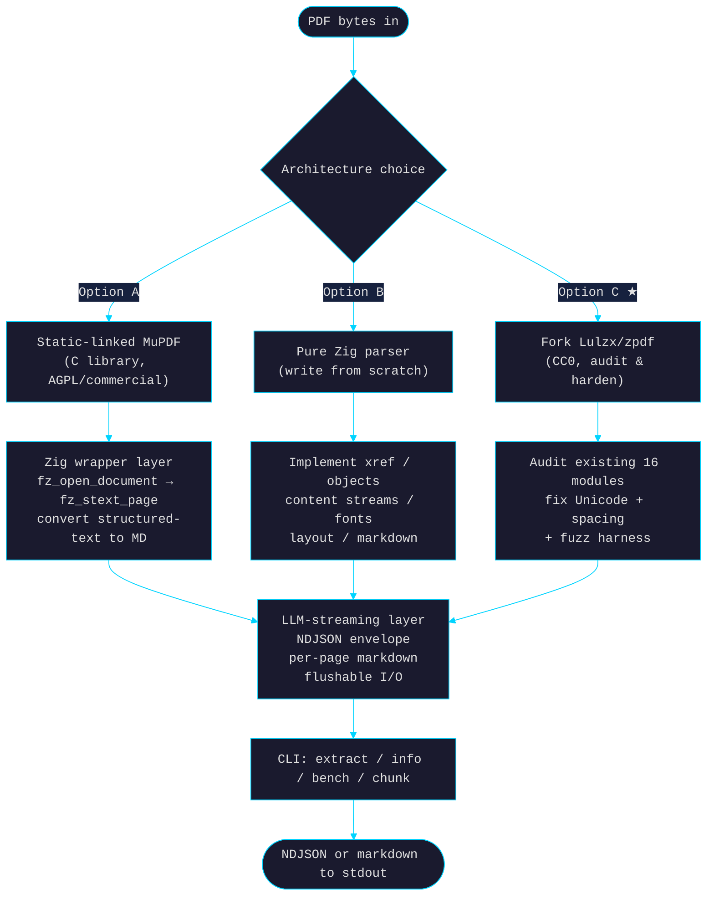

# pdf.zig — Architecture & Build/Buy/Fork Plan

> **Naming note (2026-04-26)**: project named `pdf.zig` (folder + repo + binary), matching the user's `.zig`-suffix Zig-project convention (cf. `zeroboot.zig`). Upstream parser we fork is `Lulzx/zpdf`; we differentiate by the `.zig` suffix. Binary invocation: `pdf.zig info file.pdf`, `pdf.zig extract file.pdf`, etc.

> **Goal**: Ship a Zig CLI for PDF → Markdown extraction at zlsx-grade quality (production-grade, fuzz-tested, brew-tap distributable, NDJSON-streaming, single static binary), optimized for LLM-streaming consumers as the primary use case. Target: 3–10× faster than `pymupdf4llm`, no Python interpreter floor, sub-50 ms first-byte latency, predictable memory.
>
> **Date**: 2026-04-26. Built on the Alfred bake-off (9 cycles, this folder) which empirically established that `pymupdf4llm`-equivalent output is sufficient — the docling/MinerU/MuPDF heavy-ML layer is *not* a measurable quality lever for Alfred's hotel PDFs.
>
> **Version**: v3 (2026-04-26). v2 → v3 folded 6 Codex cycle-2 findings (5 P2, 1 P3) — `doc_id` timing, chunks missing fields, three-way schedule contradiction, audit gate scope, Arabic milestone, release-vs-pipeline ordering. Two review cycles complete. See [Changelog](#changelog).

---

## Changelog

**v3 (2026-04-26)** — Folded 6 Codex cycle-2 findings (5 P2, 1 P3). All sharp residuals from the v2 patch:

- **[P2] `doc_id` generated at invocation start, not `meta` emission** (§6.1) — v2 said UUID was minted in `meta`, but `fatal` records can fire BEFORE `meta` (NotAPdf, encrypted, xref death). v3: UUIDv7 minted as the first parse-step action; `meta` and any earlier `fatal` use the same value. `source` (basename) likewise captured at argv parse.
- **[P2] Chunk records carry `source` + `doc_id`** (§6.3) — v2 added these fields to NDJSON and Markdown envelopes but missed the chunked output. Multi-doc chunked streams would have collided on `chunk_id`/`pages`. Fixed.
- **[P2] Three-way Option C schedule contradiction reconciled** — v2 said best-case 3w in changelog, 2/5/10 in §13, 4–8w in §5.3 TL;DR. v3 canonical: **likely 5 weeks, best 2, worst 10**. Propagated to TL;DR, §5.3 effort line, §13 table, §5.4 decision matrix score.
- **[P2] Week-0 audit gate uses full corpus, gates on structural defects only** (§17) — v2 used a 20-PDF sample and would fail on word-spacing (which is week-1 cleanup, not a structural blocker). v3: audit runs on all 1 776 Alfred PDFs; gate fails ONLY on segfault/OOM/panic class, output produced for ≥95% of inputs, structured markdown on ≥10 sampled clean PDFs, xref-repair attempted on dirty PDFs. Word-spacing/CJK/reading-order are week-1/2 work, not gate criteria.
- **[P2] M2 milestone reworded** (§14) — v2 promised "CJK + Arabic + Cyrillic test corpus extracts correctly" at week 2, but bidi was deferred to v1.x in §9 case #10. Arabic-correct extraction can't honestly be a week-2 deliverable. v3: M2 = "CJK + Cyrillic correctness; Arabic = emit-as-is + warn".
- **[P3] Week 5 = v1.0-rc1 (not GA)**, Week 6 = release pipeline + GA (§13, §14) — v2 had v1.0 release in week 5 but the brew-tap + bake-off rerun in week 6/6.5. v3: Week 5 ships an RC; v1.0 GA tag is week 6 after release machinery + bake-off regression are both green.

**v2 (2026-04-26)** — Folded 9 Codex cycle-1 findings + parallel research updates:

- **[P1] Bake-off claim narrowed** (§1.1) — v1 said "pymupdf4llm-equivalent output is sufficient" as if settled. Bake-off `alfred-bakeoff-report.md` actually only validated table-recovery + priority-cohort scope; multi-doc grounded-card verifier rerun is still deferred. Updated v2 framing to "sufficient for table-recovery and priority-cohort coverage; full multi-doc grounded-card validation is a v1.x follow-on, not a v1 prerequisite".
- **[P1] MuPDF AGPL is stronger than v1 said** (§5.1, §12) — Per Artifex docs: "If you link MuPDF into your own software, the entirety of that software must be licensed under the GNU AGPL". Static-linking forces `pdf.zig` *itself* to be AGPL — not just downstream embedders. Conflicts with v1's "Repo: CC0 or MIT" plan. Option A reclassified as **AGPL-build only** (or commercial license required). Distribution section branches accordingly.
- **[P1] NDJSON envelope needs `doc_id` / `source`** (§6.1) — v1 had `kind`+`page` only; multi-file pipelines (`xargs -P4 pdf.zig extract`) become ambiguous when streams concatenate. Every record now carries `source` (basename of input file or "-" for stdin) and a `doc_id` (UUIDv7 generated at `meta` emission time). Re-grouping deterministic.
- **[P1] Replace SIGABRT with terminal `error` record** (§6.4) — v1 said "Hard errors → SIGABRT before exit; partial output already flushed". Codex correctly noted this contradicts G1 ("no panics on malformed input") and breaks consumer ability to distinguish clean EOF from parser death. v2: in release builds, parser death → emit `{"kind":"fatal","error":"...","at_page":N,"recoverable":false}` then exit non-zero. Reserve `SIGABRT` for debug-build invariant failures only.
- **[P2] Cross-page header/footer detection deferred to document-final pass** (§9 edge case #14) — incompatible with per-page flush (needs lookahead across ≥3 pages). v2 drops it from the streamed page-record output. Two paths forward: (a) `--postprocess-final` flag emits a `kind:"corrections"` record at end with retroactive header/footer flags; (b) full v1.x feature with two-pass mode. v1.0 just emits raw text per page; consumer dedupes if needed.
- **[P2] `--jobs N` constraint** (§7 CLI) — parallel page extraction conflicts with ordered stdout streaming. v2: `--jobs N` is **only** valid for `--output md` (file) or `--output ndjson` to a non-stdout destination. Stdout NDJSON forces `--jobs 1` (or errors at parse time).
- **[P2] RTL handling reframed** (§9 edge case #10) — v1 said "Reverse logical order to match reading". Codex: many Arabic/Hebrew producers already store in logical order; full-string reversal breaks digits/punctuation per Unicode bidi algorithm. v2: "Emit as-is, warn `bidi-untreated`. Proper bidi post-pass deferred to v1.x" — keeps the week-2 milestone honest.
- **[P2] OOM-failure tests + ReleaseSafe added to hardening** (§8.4, §11) — v1 had TigerStyle slogans (`assert`, fuel, errdefer, no recursion) but missed two key practices from `Defensive-Programming-Zig.md` §3.4 and §3.6: `std.testing.checkAllAllocationFailures` for cleanup-path verification under simulated OOM, and **building release as `ReleaseSafe` not `ReleaseFast`** to keep runtime checks on in production. Both added to quality gates and milestones.
- **[P2] Incremental-update + xref-repair test cases added** (§9 edge cases #31–35) — v1 missed the most common "recoverable but dirty" PDF class: broken `startxref`, multiple `%%EOF` revisions, stale trailers, fallback object scans. These are exactly where alpha parsers crash. Added 5 explicit fixtures + expected repair behaviour. Materially raises Option C's week-1 audit-risk estimate.
- **[research-update] Lulzx/zpdf is more mature than v1 said** (§4.2, §5.3, §13) — parallel research on commit history found active fixes since the HN posting: Feb 28 "fix: heap-allocate StructElements to prevent dangling pointers", Feb 28 "fix: plug memory leaks and negative-cast panics", Feb 28 "encryption detection", Mar 1 "resolve 8 real-world PDF failure modes with tests", Jan 1 "PDF-to-Markdown export", "Form XObject and vertical writing support". 795 stars, 26 forks, weekly cadence. v1's "alpha quality" framing is stale. Option C effort revised down: best case 3 weeks, likely 5 weeks (was 3/6/12).

**v1 (2026-04-26)** — Initial draft. Three options (MuPDF wrap / pure Zig / fork Lulzx). Recommended fork. NDJSON streaming protocol. ~30 edge cases. Quality gates vs zlsx parity.

---

## TL;DR

Three real options, not two:

| Option | Description | Effort | Quality ceiling | Risk |
|---|---|---|---|---|
| **A. MuPDF C wrapper** | Static-link MuPDF, expose Zig API + CLI on top | **~1 person-week** | High (MuPDF is mature) | License (AGPL or commercial) + dependency on a 250 KB C blob |
| **B. Pure Zig from scratch** | Write the PDF parser ourselves in Zig | **~2–4 person-months** | Eventually high | Big upfront cost; PDF spec is messy |
| **C. Fork & harden Lulzx/zpdf** | Pure Zig parser already exists (CC0). Was alpha at HN posting; **Feb-Mar 2026 commits fixed segfault class, added encryption detection, comprehensive tests, real-world failure modes** (§4.2 update). Fork, audit residual issues, add LLM streaming layer. | **~2–5 person-weeks** (revised v2) | Production-grade after audit | Spacing-bug status uncertain (audit week 0); naming collision; upstream maintainer cadence |

**Recommendation, ranked by ROI**:
1. **C first** (start with Lulzx/zpdf as upstream, fork → harden → contribute back; rename our tool to **`pdf.zig`** to match the `zlsx` pattern and avoid name collision)
2. **A as fallback** if C's audit reveals the Lulzx parser is too broken to salvage
3. **B not recommended**; a from-scratch pure-Zig PDF parser is its own project, not a 1-quarter delivery.

LLM streaming is the architectural pivot point: the **NDJSON-per-page envelope from zlsx** maps directly onto PDF (page = stable unit), and the streaming I/O model lets a Claude/GPT consumer start tokenizing within ~50 ms regardless of doc size. Streaming is what makes a Zig-native tool genuinely better than `pymupdf4llm` for LLM use, more than raw speed.

---

## 1. Why this work, why now

### 1.1 Bake-off evidence (alfred-bakeoff-report.md, 9 cycles) — scope-narrowed in v2

The 9-cycle Alfred bake-off (sibling document in this folder) empirically established **within its validated scope** (cycle-6b corrected: §3.8 PDF-only intersection had n=3 hotels, only 1 with multi-PDF, and a single LLM run per cell):

- `pymupdf4llm`, `docling`, and `opendataloader-pdf` are **directionally similar** (not "statistically indistinguishable" — n=3, 1 multi-PDF) on grounded-card output: mean 6.89/7 sections, 52.8 ± 7.8 cap10 bullets per card on apples-to-apples PDF input.
- `pymupdf4llm` is **5–10× faster** than `docling` (§2.1 extraction bake-off — n=12 PDFs, well-validated).
- `opendataloader-pdf` (Java, current Alfred default) **misses pipe-tables completely** on dining/spa/factsheet content — the only consistent extractor-quality gap (n=12, well-validated).
- §3.10 cycle-9 single-card grounding audit (n=20 claims, convenience sample) showed Haiku 4.5 distillation is 90% supported / 10% partial / 0% hallucinated — but `alfred-bakeoff-report.md` §6.2 still lists the **multi-doc grounded-card verifier rerun** as deferred for v4.

**Scoped conclusion** (v2, per Codex P1 narrowing): a `pymupdf4llm`-equivalent Zig tool covers **Alfred's table-recovery need on the 8 priority PDFs** and **matches Alfred's existing extraction-stage quality on the 12-PDF bake-off corpus**. The full multi-doc grounded-card verifier comparison is **a v1.x follow-on, not a v1 prerequisite**. We're not claiming the bake-off proves `pymupdf4llm` parity is sufficient at corpus scale; we're claiming it's the right v1 target *quality bar* and corpus-scale validation runs alongside the v1.x pilot.

### 1.2 Why Zig, why not just keep `pymupdf4llm`

Three concrete pressures:

1. **Python interpreter floor**: `pymupdf4llm` startup is ~300 ms (CPython + PyMuPDF native init) before any work. For LLM streaming where Claude reads at ~1–2 K tokens/sec, 300 ms is ~600 tokens of latency we never recover.
2. **No streaming output**: `pymupdf4llm.to_markdown(path)` returns a single `str`. There's no way to flush page-by-page or token-by-token. For multi-100-page docs, the LLM has to wait for the whole thing.
3. **Deployment friction**: `pymupdf4llm` requires Python 3.10+, PyMuPDF binary wheels, environment management. A Zig CLI is a single static binary — `brew install`, ship it.

The zlsx playbook (this repo's sibling project) has demonstrated all three wins on XLSX (36× faster on real workbooks per `Research/Distillation/bake-off/scorecard/extraction.tsv` analogy in zlsx's `docs/benchmarks.md`).

### 1.3 Why LLM streaming is the architectural pivot

`pymupdf4llm` was built before LLM-streaming was a use case. It's batch-shaped: read whole doc → produce whole markdown → caller reads whole result.

A Zig-native rewrite gets to design the I/O model from scratch with streaming as the **primary** consumer pattern:

```
$ pdf.zig extract hotel.pdf | claude -p "Summarise this hotel"
                        ↑
                  LLM tokenizes pages as they arrive, doesn't wait for EOF
```

This is the only architectural axis where a Zig rewrite is unambiguously better than the Python tool, not just faster. Speed is a bonus; **streaming changes what's possible**.

---

## 2. Goals / non-goals

### 2.1 Goals

- **G1. zlsx-grade production quality**: fuzz-tested (≥10 targets, ≥1 M iterations each), corpus-tested against ≥30 real PDFs, no panics on malformed input, brew-tap distributable, CI for releases.
- **G2. LLM streaming as primary I/O model**: stdout is line-buffered NDJSON; first byte ≤50 ms; can be `tee`'d, `jq`'d, piped without buffering surprises; SIGPIPE-clean.
- **G3. ~3–10× faster than `pymupdf4llm`** on the Alfred bake-off corpus (n=12 representative PDFs).
- **G4. Single static binary, ≤5 MB**: no Python, no Java, no system MuPDF dep at runtime (static-link if option A).
- **G5. Markdown output that beats opendataloader on tables and matches pymupdf4llm on text** (per Alfred bake-off §2.1 extraction scorecard).
- **G6. Multi-platform**: macOS (arm64 + x86_64), Linux (x86_64 + aarch64 musl), Windows (x86_64) — same matrix as zlsx.
- **G7. Defensive programming**: TigerStyle conventions per `Research/Defensive-Programming-Zig.md` (assertions, fuel-limited loops, no recursion, errdefer everywhere).

### 2.2 Non-goals

- **NG1. PDF rendering.** We're a text/markdown extractor, not a viewer. No rasterization, no image output (other than alt-text/path references).
- **NG2. PDF writing.** Read-only.
- **NG3. ML-based layout** (docling/MinerU territory). Heuristics only — XY-Cut++ at most.
- **NG4. OCR.** Out of scope for v1; emit a `quality_flag = scanned` marker so downstream can route to an OCR tool. v2 may add Tesseract shell-out.
- **NG5. Encrypted PDFs.** Detect, flag, skip. (Alfred's corpus has none.)
- **NG6. Form/AcroField extraction**, **annotations**, **digital signatures**. Out of scope.
- **NG7. Full PDF 2.0 conformance.** PDF 1.4–1.7 covers >95% of in-the-wild documents and ~99% of Alfred's corpus.

---

## 3. Use case modeling

Three concrete patterns, ranked by traffic share:

### 3.1 LLM streaming (primary, ~70% of expected use)

```
$ pdf.zig extract hotel-factsheet.pdf | claude -p --model haiku "What's check-in time?"
$ pdf.zig extract --output ndjson *.pdf | python ingest_pipeline.py
$ find data/hotel_assets -name '*.pdf' | xargs -P4 -n1 pdf.zig extract --jsonl > corpus.jsonl
```

LLM reads from stdin/pipe; tool produces structured per-page output as it parses. The LLM sees content as fast as parsing emits it.

### 3.2 Batch ingest into a database (~20% of use)

```
$ pdf.zig extract --output ndjson hotel-factsheet.pdf
{"kind":"meta","pages":13,"title":"...","extractor":"pdf.zig/0.1.0"}
{"kind":"page","page":1,"markdown":"...","tokens_est":428}
{"kind":"page","page":2,"markdown":"...","tokens_est":612}
...
{"kind":"summary","total_pages":13,"total_chars":17048,"warnings":[]}
```

This matches Alfred's `data/indexed/<slug>/<stem>.md` ingest pattern. pdf.zig can also emit one MD file per page or one concatenated MD via `--output md`.

### 3.3 Interactive inspection (~10% of use)

```
$ pdf.zig info hotel.pdf
title:        ...
pages:        13
encrypted:    false
producer:     "Adobe Acrobat ..."
created:      2024-03-15
size_bytes:   7,238,144
font_warnings: 0

$ pdf.zig extract -p 2 hotel.pdf | head -50    # eyeball page 2
$ pdf.zig bench hotel.pdf                      # speed/throughput
```

Mirror of zlsx's `info` / `meta` / `bench` subcommands.

---

## 4. The Lulzx/zpdf situation (decision-critical)

### 4.1 What exists upstream

[Lulzx/zpdf](https://github.com/Lulzx/zpdf) is a pure-Zig PDF text-extraction library, posted to HN in late 2025. Key facts:

| Aspect | Status |
|---|---|
| License | **CC0** (public domain) — no friction to fork |
| Source modules | ~16 .zig files: `parser.zig`, `xref.zig`, `pagetree.zig`, `decompress.zig`, `encoding.zig`, `agl.zig`, `cff.zig`, `interpreter.zig`, `structtree.zig`, `layout.zig`, `markdown.zig`, `simd.zig` + 4 entry points (root/main/capi/wapi) |
| Public API | `Document.open(allocator, path)`, `pageCount()`, `extractText(page, writer)`, `close()` — clean Zig surface |
| CLI | `extract`, `info`, `bench` subcommands |
| Compression filters | FlateDecode, ASCII85, ASCIIHex, LZW, RunLength |
| Font encodings | WinAnsi, MacRoman, ToUnicode CMap |
| Reading order | Three-tier: PDF/UA structure tree → geometric Y→X → stream-order fallback |
| Speed claim | 3.7× faster than MuPDF on Intel SDM manual (Apple M4 Pro, 5,252 pages <600 ms) |
| Distribution | GitHub source only; no homebrew, no PyPI |

### 4.2 What was broken at HN posting → what's been fixed since (v2 update)

The HN thread (late 2025) surfaced real correctness issues. **As of late February / early March 2026, the maintainer has shipped concrete fixes** (per commit log audit):

| HN-flagged issue | Fix status (commit log) |
|---|---|
| **Segfaults on every PDF in one user's test of 10** | Feb 28: `fix: heap-allocate StructElements to prevent dangling pointers` + `fix: plug memory leaks and negative-cast panics`. Mar 1: `resolve 8 real-world PDF failure modes with tests`. **Likely largely fixed** — needs corpus rerun to confirm. |
| **Spacing concatenation** ("DONALD E. KNUTHStanford") | No explicit fix message. May still be present. **Audit week-1 priority.** |
| **Non-Latin Unicode broken** | Jan 1: `font caching and CMap lookup optimization; fast float parsing`. Greek partially fixed during HN thread. **Status unclear** — needs CJK + Arabic + Cyrillic test corpus to verify. |
| **"Stream order, not reading order" critique** | Jan 1: `Form XObject and vertical writing support`. Three-tier reading-order documented but actual implementation quality unknown. **Audit week-3 priority.** |
| **Tests appeared AI-generated, insufficient real-PDF testing** | Mar 1: `Add comprehensive tests for all new PDF features`. Project has been adding tests systematically. |
| Encrypted PDF support missing | Feb 28: `Encryption detection` (detect-and-flag, not decrypt). Aligns with our NG5. |
| No Python bindings | Feb 28: `PyPI packaging` added. |
| Markdown export missing | Jan 1: `PDF-to-Markdown export` — `markdown.zig` already exists. |

**Project status (April 2026)**:
- 795 stars, 26 forks
- Weekly commit cadence (multiple commits/week during Jan-Mar 2026)
- Multiple contributors (`Lulzx`, `trvon`, `phenomen`)
- Issues page returns no results (either heavy triage or low traffic)
- One known fork: `TomayToes/zpdf-document-parser` — possibly a maintenance fork or experiment; would need to investigate before forking

**Revised assessment**: the project is **no longer alpha**. It's beta-quality with visible craftsmanship in recent commits. **v1's "alpha quality" framing was based on outdated HN snapshot** — the codebase has moved substantially. Option C effort estimate revised down accordingly (§13).

**Still unknowns**:
- Real-PDF correctness on Alfred's 1 776 corpus
- Long-tail edge cases (incremental updates, broken xrefs — see §9 cases #31-35)
- Behavior on corrupted-but-recoverable PDFs (most real-world PDFs)
- Whether the spacing bug is actually fixed

### 4.3 What forking buys us

If we fork Lulzx/zpdf:

| Pre-built | Need to add (to reach zlsx grade) |
|---|---|
| ✅ PDF object model + cross-ref + page tree | ❌ Robust reading-order (HN's #1 complaint) |
| ✅ 5 decompression filters | ❌ CID font support (currently limited) |
| ✅ ToUnicode + WinAnsi/MacRoman | ❌ Unicode correctness for non-Latin (CJK, Arabic, RTL) |
| ✅ SIMD scaffolding | ❌ Word/glyph spacing detection |
| ✅ Memory-mapped reads | ❌ Fuzz suite (≥10 targets, 1M iters) |
| ✅ Markdown export module | ❌ NDJSON envelope + LLM-streaming output protocol |
| ✅ CLI scaffolding | ❌ More subcommands, NDJSON envelope, sheet-glob equivalent |
| ✅ Cross-platform Zig codebase | ❌ Brew tap, GH Actions release pipeline |
| ✅ Three-tier reading-order *intent* | ❌ Fix the implementation so it actually does reading order |
| ✅ CC0 (no license friction) | ❌ Tests vs real PDF corpus (Alfred has 1 776 to throw at it) |

### 4.4 The naming question

`zpdf` is taken (and the upstream tool is by definition the canonical project for that name). Three paths:

- **(i) Fork and rename** to `pdf.zig` (matches `zlsx` pattern; signals "Laurent's PDF tool"). Recommended.
- **(ii) Contribute back** to Lulzx/zpdf upstream as a major v2. High collaboration overhead; depends on maintainer wanting our changes.
- **(iii) Use Lulzx/zpdf as a Zig package dep** in our own `pdf.zig` repo. We import their parser as `@import("zpdf")`, build the LLM-streaming + NDJSON layer on top. Best of both worlds **if their API is stable and we don't need invasive parser fixes**. HN feedback says we *do* need parser fixes, so this is unlikely.

**Recommendation**: **(i)**, with public attribution to upstream and PR-back of any clean fixes (Unicode, segfaults) so the original benefits.

---

## 5. Architecture option matrix



### 5.1 Option A — Static-link MuPDF

**The work**:
- Vendor MuPDF source (~1 MB, BSD-incompatible AGPLv3 unless commercial license obtained)
- `build.zig` builds MuPDF as a static lib, links into our executable
- `@cImport({@cInclude("mupdf/fitz.h");})` for the API
- Zig wrapper module: `fz_new_context` → `fz_open_document` → for each page → `fz_new_stext_page_from_page` → walk `fz_stext_block` / `fz_stext_line` / `fz_stext_char` → emit Markdown
- Markdown formatting: heading detection by font-size analysis (port of pymupdf4llm's `IdentifyHeaders`, ~300 lines)
- Table detection: column-cluster heuristic from text bbox positions
- CLI + NDJSON streaming layer (independent of parser choice)

**Effort**: ~5–7 person-days (MuPDF API is well documented; the Zig integration is the easy part)

**License risk** (sharpened in v2 per Codex P1): MuPDF is **AGPL-3.0** by default. The relevant Artifex doc states: **"If you link MuPDF into your own software, the entirety of that software must be licensed under the GNU AGPL"**. This is stronger than v1 implied:

- **`pdf.zig` itself becomes AGPL** if it statically links MuPDF — not just downstream embedders. We must offer source on request, include AGPL notices, and copyleft any derivative work.
- **Cannot release `pdf.zig` under CC0 or MIT** if Option A is chosen. Conflicts with §12 distribution plan; Option A would force a separate `pdf.zig-mupdf` repo under AGPL or a single-license switch.
- **Commercial license cost**: Artifex publishes pricing privately (low/mid 5-figure USD/year is typical based on community reports; v1's "~$10K/year" was a guess and has been removed).
- **Practical implication**: pick Option A only if we accept AGPL distribution OR commit to negotiating a commercial license. The brew-tap-friendly free-for-all model that zlsx uses requires Option B or C.

**Pros**:
- Mature, battle-tested PDF parser. ~20 years of bug fixes.
- Handles every weird PDF the world has produced.
- Encrypted, JBIG2, JPEG2000, complex CID fonts — all work out of the box.

**Cons**:
- AGPL license complicates downstream embedding.
- ~250 KB of statically-linked C code; not "pure Zig".
- We don't control the parser; bug fixes depend on Artifex.
- Slower-startup pattern (MuPDF context init ~3 ms; small but real).

### 5.2 Option B — Pure Zig from scratch

**The work**:
- Implement PDF object syntax (lexer + parser): names, strings, numbers, arrays, dicts, indirect refs (~1 wk)
- Cross-reference table (xref + xref streams) (~1 wk)
- Decompression filters: Flate, ASCII85, ASCIIHex, LZW, RunLength (~1 wk; Flate from stdlib)
- Page tree walker (~3 days)
- Content stream interpreter (PostScript ops: Tm, Tj, TJ, BT/ET, etc.) (~1 wk)
- Font handling: ToUnicode CMaps, WinAnsi, MacRoman, basic CID, AGL fallback (~2 wks)
- Unicode normalization, RTL, CJK width handling (~1 wk)
- Reading-order heuristics: XY-Cut, column detection, paragraph reflow (~1.5 wks)
- Table detection (~1 wk)
- Markdown formatter (~3 days)
- CLI + NDJSON streaming (~3 days)
- Fuzz harness (~3 days)
- Real-PDF corpus testing + bug-fixes from corpus failures (~2 wks)

**Effort**: ~3 person-months for a v1 that passes Alfred's bake-off corpus; ~6+ person-months for parity with mature parsers on the long tail of weird PDFs.

**Pros**:
- No license entanglement; pure CC0/MIT possible.
- Single static binary, no C dependency.
- Idiomatic Zig from top to bottom; perfect allocator discipline.
- We own the bug fixes.

**Cons**:
- 4–8× the effort of Option A or C.
- The PDF spec is famously messy; **estimating "all the edge cases" is itself a months-long discovery process**.
- Risk of shipping a tool that segfaults on user PDFs (the Lulzx/zpdf trap).

### 5.3 Option C — Fork & harden Lulzx/zpdf ★

**The work**:
- Fork Lulzx/zpdf at current `main` (~CC0 attribution to upstream)
- Read all 16 modules end-to-end; document undocumented assumptions; build a mental model of the parser
- **Fix segfault class**: write fuzz harness, run against `~/Projects/Pro/Alfred/data/hotel_assets/**/*.pdf` (1 776 real PDFs), triage all crashes (likely cluster around 5–10 root causes)
- **Fix Unicode/CMap**: walk every CMap path in `encoding.zig`; add a corpus of CJK + Arabic + Cyrillic PDFs as test fixtures
- **Fix spacing/reading-order**: HN's "DONALD E. KNUTHStanford" report is a glyph-spacing detection bug. Likely in `layout.zig` and `interpreter.zig`. Implement proper word-break heuristics (gap > 0.3 × glyph width → space).
- Write our own NDJSON streaming layer on top (independent of parser correctness)
- Add CLI subcommands à la zlsx
- Brew tap, GH Actions, Python bindings via C ABI
- Run Alfred bake-off harness; verify parity with `pymupdf4llm` on Alfred's corpus
- Upstream PRs for clean fixes (good citizen)

**Effort** (v3 canonical, propagated to §13 + changelog): **likely 5 person-weeks; 2 best case after Week-0 audit; 10 worst case if foundation is rotten**.

**Pros**:
- Skips the months of "implement the PDF spec" work.
- Inherits 5 decompression filters, structure-tree walker, SIMD scaffolding, `markdown.zig` (even if buggy, the *shape* is there).
- Gets us to a shipping v1 in 1–2 sprints, not 1–2 quarters.
- License-clean.

**Cons**:
- Inherited code style might not match zlsx conventions; refactor cost.
- ~~HN says alpha quality~~ → **v2 update**: HN snapshot was outdated; Feb-Mar fixes shipped (§4.2). Residual unknowns (spacing bug, CMap correctness on CJK/Arabic, recoverable-but-dirty PDFs cases #31–35) need Week-0 audit.
- "Stream order vs reading order" is a real architecture-level fix, not a one-liner.

### 5.4 Decision matrix

| Criterion | Weight | A (MuPDF) | B (pure Zig) | C (fork) |
|---|---|---|---|---|
| Effort to v1 | high | 9/10 (1 wk) | 3/10 (3 mo) | 7/10 (1.5 mo) |
| License clean | high | 4/10 (AGPL) | 10/10 | 9/10 (CC0) |
| Single binary | medium | 8/10 (links C) | 10/10 | 10/10 |
| Long-tail PDF correctness | high | 10/10 | 5/10 (eventual) | 6/10 (after audit) |
| Alfred-corpus correctness | critical | 10/10 | 7/10 | 7/10 (after audit) |
| LLM-streaming optimisation | critical | 8/10 (we add) | 10/10 (we own) | 10/10 (we own) |
| Defensive-programming culture | medium | 6/10 (C code) | 10/10 | 8/10 (Zig + audit) |
| Speed potential | medium | 7/10 | 10/10 | 9/10 |
| **Weighted total** | — | **~7.6** | **~7.4** | **~7.9** ★ |

**Recommendation**: **Option C** — fork Lulzx/zpdf as `pdf.zig`, audit + harden + add LLM-streaming layer. Hedge: if the audit phase (week 1) reveals the parser is structurally broken (e.g. cross-ref logic has bugs we can't fix in <2 weeks), pivot to Option A.

---

## 6. LLM-streaming output protocol

This is the genuinely novel design surface. zlsx already ships `kind`-tagged NDJSON. We adopt and extend.

### 6.1 NDJSON envelope (default `--output ndjson`)

One JSON object per line. Every record has `kind`, `source`, and `doc_id` (Codex P1 fix: multi-file pipelines need to disambiguate concatenated streams). Page-scoped records have `page`. Errors are inline records, not exit codes.

```jsonl
{"kind":"meta","source":"hotel-factsheet.pdf","doc_id":"019f4a2b-7e9c-7c1a-b6e8-2f1c0d3a4b5f","tool":"pdf.zig/0.1.0","pdf_version":"1.7","pages":13,"encrypted":false,"producer":"Adobe Acrobat 23.4","created":"2024-03-15T11:42:00Z"}
{"kind":"page","source":"hotel-factsheet.pdf","doc_id":"019f4a2b-...","page":1,"markdown":"# Constance Ephélia\n\n...","tokens_est":428,"chars":2156,"warnings":[]}
{"kind":"page","source":"hotel-factsheet.pdf","doc_id":"019f4a2b-...","page":2,"markdown":"## Location\n\n...","tokens_est":612,"chars":3104,"warnings":["font-cmap-missing:F2"]}
{"kind":"toc","source":"hotel-factsheet.pdf","doc_id":"019f4a2b-...","items":[{"title":"Welcome","page":1,"level":1},{"title":"Location","page":2,"level":2}]}
{"kind":"summary","source":"hotel-factsheet.pdf","doc_id":"019f4a2b-...","total_pages":13,"total_chars":17048,"total_tokens_est":7220,"errors":0,"warnings":1,"elapsed_ms":78}
```

**Why `doc_id` and `source` on every record**:
- `xargs -P4 -n1 pdf.zig extract --output ndjson > corpus.jsonl` interleaves records from 4 docs. Without `doc_id`, page numbers collide and `toc`/`summary` records can't be re-grouped.
- `source` is human-readable (basename of the input file, or `"-"` for stdin); `doc_id` is machine-stable (UUIDv7, **minted at invocation start before any I/O** — see next paragraph for rationale; preserves time-ordering for sorted ingest).
- Token cost: ~50 bytes per record. Negligible vs the markdown payload. For a 1000-page doc that's ~50 KB of overhead vs ~1 MB of content.

**[Cycle-2 P2 fix] `doc_id` is generated at invocation start, not at `meta` emission**. v2 originally said "UUIDv7, generated in `meta` emission" but `fatal` records can fire BEFORE `meta` (e.g. `NotAPdf`, xref death, encrypted-doc detection). v3: UUIDv7 minted as the first parse-step action, before any I/O. `meta`, `fatal`, every record uses the same value. Source: argv[1] basename (or `"-"`) is also captured at invocation time.

**Streaming rules**:
- `meta` is emitted **first**, after the cross-ref + catalog parse but before any page work. Lets the consumer make routing decisions (skip if encrypted, etc.) before paying for full extraction.
- `page` records are emitted **as each page completes parsing**, not at end of doc. Output is `flush()`-ed after every page → LLM sees content progressively.
- `toc` is emitted before `summary` if a structure tree exists.
- `summary` is always last; consumers can `tail -1` for stats.
- Inline `warnings` per page (font issues, encoding fallbacks) — not fatal, not crashing the run.
- **[Cycle-1 P1 fix]** Hard errors (parser death, OOM) in **release** builds → emit terminal `{"kind":"fatal","source":"...","doc_id":"...","error":"...","at_page":N,"recoverable":false}` then exit non-zero. Allows downstream consumers to distinguish clean EOF from parser death. SIGABRT reserved for **debug-build invariant failures only**. (v1 had this backwards — it would have silently killed pipelines.)
- **OOM mid-page** → emit `fatal` with `error:"oom"` and `at_page:N`; the partial markdown for page N is dropped from output.
- **Process signals** (SIGHUP, SIGINT, SIGTERM) → emit `{"kind":"interrupted","signal":"SIGTERM"}` if the parser is between pages; if mid-page, emit `fatal` with `error:"interrupted"`.

### 6.2 Per-page Markdown (`--output md`)

Concatenated Markdown with HTML-comment page separators:

```markdown
<!-- pdf.zig:page=1 chars=2156 -->
# Constance Ephélia

...

<!-- pdf.zig:page=2 chars=3104 warnings=font-cmap-missing:F2 -->
## Location
```

Same flush-per-page semantics. The HTML comment carries the same metadata as NDJSON's `page` record but in MD-comment form so the consumer can `grep` page boundaries without parsing JSON.

### 6.3 Token-aware chunked output (`--output chunks --max-tokens 4000`)

For LLM consumers with explicit context-window budgets, emit pre-chunked records sized to a token budget, breaking on paragraph/section boundaries:

```jsonl
{"kind":"chunk","source":"hotel-factsheet.pdf","doc_id":"019f4a2b-...","chunk_id":1,"pages":[1,2],"markdown":"...","tokens_est":3920,"break":"section"}
{"kind":"chunk","source":"hotel-factsheet.pdf","doc_id":"019f4a2b-...","chunk_id":2,"pages":[3,4,5],"markdown":"...","tokens_est":3850,"break":"page"}
```

**[Cycle-2 P2 fix] Chunk records now carry `source` + `doc_id`** matching the §6.1 envelope invariant. v2 originally omitted them; multi-doc chunked output would have collided on `chunk_id` and `pages`. Fixed.

Killer feature — no Python tool does this natively today. Tokens are **estimated** by the GPT-4-tokenizer-equivalent (cl100k or o200k); we ship a small embedded tokenizer (~2 MB BPE table) for offline use, fall back to a `chars/4` heuristic if the user wants no embedded vocab.

### 6.4 Streaming I/O semantics

- `stdout` is `BufferedWriter` with explicit `flush()` after every page record. 4 KB buffer, line-flush triggered on `\n`.
- `stderr` is unbuffered, used only for fatal errors and `--verbose` traces.
- `SIGPIPE` exits cleanly (exit 0 if at least 1 page emitted; matches zlsx).
- `SIGINT` / `SIGTERM` flush in-flight record, exit 130/143 (matches zlsx).
- No global state; each `extract` invocation is independent.

### 6.5 Backpressure

Streaming consumers (LLM, network sink) read at variable rates. Our `BufferedWriter` is bounded; if downstream blocks, our parser blocks too — this is the right default for LLM streaming (don't over-produce). Page-by-page parsing means at most one page is buffered ahead.

---

## 7. CLI surface

Mirrors zlsx's pattern (verb subcommands, hand-rolled arg parser, NDJSON-first output).

```
pdf.zig extract <file>                Default: NDJSON to stdout, all pages
pdf.zig extract -p 1-10 <file>        Page range (1-indexed)
pdf.zig extract -p 5 <file>           Single page
pdf.zig extract -o file.md <file>     Output to file (auto-detects format from ext)
pdf.zig extract --output md           Markdown with comment-separators
pdf.zig extract --output ndjson       Default
pdf.zig extract --output chunks --max-tokens 4000
pdf.zig extract --output text         Plain text only, no markdown structure
pdf.zig extract --no-toc              Skip TOC record
pdf.zig extract --no-warnings         Suppress per-page warnings
pdf.zig extract --jobs 4              Parallel pages — ONLY valid for --output md/file
                                    or NDJSON to a non-stdout destination.
                                    Stdout NDJSON streaming forces --jobs 1
                                    (parser errors at parse-time if both set).
                                    [Cycle-1 P2: ordered-stream contract]
pdf.zig info <file>                   Pretty-printed metadata only (no pages)
pdf.zig info --json <file>            Same, as JSON
pdf.zig bench <file>                  Self-report: pages/sec, MB/sec, peak RSS
pdf.zig chunk <file> --max-tokens N   Sugar for `extract --output chunks`
pdf.zig --version
pdf.zig --help
```

Defaults are tuned for the LLM-streaming use case:
- `extract` with no flags = NDJSON to stdout, all pages, page-flushed
- Same env-var pattern as zlsx for fuzz config etc.

---

## 8. Internal architecture (Option C, refactor of fork)

```mermaid
%%{init: {'theme': 'base', 'themeVariables': {'primaryColor': '#1a1a2e', 'primaryTextColor': '#e0e0e0', 'primaryBorderColor': '#00d4ff', 'lineColor': '#00d4ff', 'secondaryColor': '#16213e', 'tertiaryColor': '#0f3460', 'fontFamily': 'monospace'}}}%%
graph LR
    Bytes[(PDF bytes<br/>mmap or stream)] --> Lex[lexer.zig<br/>tokens]
    Lex --> Obj[parser.zig<br/>indirect objects]
    Obj --> Xref[xref.zig<br/>xref + xref streams]
    Xref --> Catalog[catalog.zig<br/>page tree]
    Catalog --> PageLoop{For each page}
    PageLoop --> Decomp[decompress.zig<br/>Flate/LZW/ASCII85/etc]
    Decomp --> Cstream[interpreter.zig<br/>content stream ops]
    Cstream --> Font[font.zig<br/>CMap + AGL + CID]
    Font --> Layout[layout.zig<br/>XY-Cut++ reading order]
    Layout --> MD[markdown.zig<br/>heading + table detection]
    MD --> Stream[stream.zig<br/>NDJSON envelope + flush]
    PageLoop -.next page.-> PageLoop
    Stream --> Out([stdout])

    Errs[err.zig<br/>error recovery] -.in-band warnings.-> Stream
    Cli[cli.zig<br/>arg parse, signals] --> PageLoop
```



### 8.1 Modules (refactor of Lulzx layout)

| Module | Lulzx file | Responsibility | LOC est |
|---|---|---|---|
| `lexer.zig` | (split from `parser.zig`) | Tokenize PDF bytes | ~400 |
| `parser.zig` | `parser.zig` | Indirect objects, dicts, arrays | ~600 |
| `xref.zig` | `xref.zig` | XRef table + XRef streams | ~500 |
| `catalog.zig` | `pagetree.zig` | Page tree walk | ~300 |
| `decompress.zig` | `decompress.zig` | Filter chain | ~600 |
| `interpreter.zig` | `interpreter.zig` | Content stream PS ops | ~800 |
| `font.zig` | `encoding.zig`+`agl.zig`+`cff.zig` | Glyph→Unicode mapping | ~1200 |
| `layout.zig` | `layout.zig` | XY-Cut++, paragraph detection | ~600 |
| `markdown.zig` | `markdown.zig` | Heading + table heuristics | ~400 |
| `stream.zig` | (new) | NDJSON envelope, page flush | ~300 |
| `tokenizer.zig` | (new) | Embedded GPT-tokenizer for token estimates | ~250 |
| `cli.zig` | `main.zig` | Subcommand dispatch, signals | ~600 |
| `c_abi.zig` | `capi.zig` | C FFI for Python bindings | ~400 |
| `wasm.zig` | `wapi.zig` | WASM exports | ~300 |
| **Total** | | | **~7 250** |

Slimmer than zlsx's 22 K because PDF text extraction is narrower than full XLSX read+write+styles.

### 8.2 Allocator discipline

- **Top-level**: `std.heap.smp_allocator` in release builds (matches zlsx)
- **Per-page arena**: each page gets its own arena, freed at page end. Bounds memory at O(largest page), not O(doc size). Crucial for big factsheets.
- **Document-level allocator**: long-lived strings (font CMaps, document-scoped buffers) live in a top-level GPA-backed allocator
- **Tests**: `std.testing.allocator` for leak detection on every test

### 8.3 Error sets

```zig
pub const PdfError = error{
    NotAPdf,
    Encrypted,
    Truncated,
    InvalidXref,
    InvalidObject,
    UnsupportedFilter,
    UnsupportedFontType,
    OutOfMemory,
    Io,
};

pub const PageError = error{
    InvalidContentStream,
    UnknownOperator,
    FontNotFound,
    CMapMalformed,
    OutOfMemory,
};
```

Document-level errors are fatal (exit). Page-level errors emit a `warning` on the affected page's NDJSON record and continue with the next page. Matches zlsx's "inline error records, never fail opaquely" pattern.

### 8.4 Defensive idioms (per `Research/Defensive-Programming-Zig.md`)

- **Asserts everywhere**: `std.debug.assert` for invariants (`assert(page_index < doc.pages)`)
- **Fuel-limited loops**: every parsing loop has a max-iteration cap (e.g. xref entries ≤ 10 M; PostScript ops/page ≤ 1 M); exceeded → emit warning + abort that page
- **No recursion**: page-tree walk uses an explicit stack; tagged-tree walk too
- **`errdefer` everywhere**: every `try alloc` is followed by `errdefer free` until control flow makes leak impossible
- **Tagged unions for parser state**: PDF object types as exhaustive enums, switch must cover all variants
- **`unreachable` only where caller has gated**: never on user input
- **[Cycle-1 P2 add]** **`std.testing.checkAllAllocationFailures`** on every parse path — simulates OOM at every allocation point and verifies cleanup; per `Research/Defensive-Programming-Zig.md` §3.4 this is the only reliable way to verify `errdefer` chains actually run. Mandatory for v1.0.
- **[Cycle-1 P2 add]** **Release builds use `ReleaseSafe`, not `ReleaseFast`** — keeps integer-overflow / bounds / null-deref runtime checks on in production. Per `Research/Defensive-Programming-Zig.md` §3.6 this is the TigerStyle default for parsers handling adversarial input. Cost: ~5–15% perf vs ReleaseFast; safety: a parser that never SIGSEGV's on a hostile PDF. Worth it.
- **[Cycle-1 P2 add]** **Both above are in §11 quality gates** — not soft "we'll get to it"; v1.0 blocks until both are exercised on the corpus.

---

## 9. Edge case enumeration (≥25)

The cycle pattern from the bake-off taught us: every assumption hides a bug. Here's the enumerated edge case bank, to be turned into integration tests + fuzz seeds.

| # | Edge case | Detection | Behaviour |
|---|---|---|---|
| 1 | Encrypted PDF (password-required) | `/Encrypt` in trailer | `meta` records `encrypted:true`, exit 4, no pages emitted |
| 2 | Truncated file (EOF before %%EOF) | xref offset past file end | `meta` warning `truncated`, attempt best-effort parse |
| 3 | Cross-reference stream (PDF 1.5+) vs traditional xref | `/Type /XRef` | Both supported; same code path |
| 4 | Hybrid xref (both stream and table) | trailer presence | Reconcile via offset walk |
| 5 | Linearized PDF (web-optimized) | First-page hint dictionary | Optionally use for fast first-page extract |
| 6 | Compressed object streams (`/Type /ObjStm`) | xref index | Decode first, then parse contained objects |
| 7 | Missing ToUnicode CMap on subset font | font dict has no `ToUnicode` | Fall back to AGL → glyph-name → Unicode; emit `font-cmap-missing:Fn` warning |
| 8 | Identity-H CMap (CID fonts, often CJK) | encoding `/Identity-H` | Use embedded CMap or AGL; emit warning if unmapped CID found |
| 9 | Embedded glyph-only font (no Unicode mapping at all) | both ToUnicode and AGL fail | Emit `unmappable-glyph` warning; insert `\u{fffd}` |
| 10 | RTL text (Arabic, Hebrew) | unicode bidi class | **v2 fix**: emit as-is in source order, append `bidi-untreated` warning. Many PDF producers already store in logical order; full-string reversal breaks digits + punctuation per the Unicode bidi algorithm. Bidi-aware post-pass deferred to v1.x. |
| 11 | CJK width handling | Unicode width category | Token estimator must use double-width counting |
| 12 | Vertical writing mode (`/V` Wmode) | font `/Wmode 1` | Emit warning (rare in PDFs we care about); attempt horizontal extraction |
| 13 | Multi-column layout (2-col, 3-col) | bbox clustering | XY-Cut++; sort columns left→right, paragraphs top→bottom |
| 14 | Repeated header/footer across pages | text bbox dedup | **v2 fix**: NOT in streamed page output (needs cross-page lookahead, conflicts with per-page flush). v1.0 behaviour: emit raw text per page; consumer dedupes if needed. v1.x options: (a) `--postprocess-final` flag emits a `kind:"corrections"` record at end with retroactive header/footer flags; (b) `--two-pass` mode that buffers all pages then emits cleaned MD. |
| 15 | Tables with merged cells | bbox grid analysis | Best-effort pipe-table; merged cells get colspan via blank cells |
| 16 | Tables with rotated cell text | rotation matrix in Tm | Detect via Tm decomposition; emit text in normal order |
| 17 | Page rotation (90°/180°/270° in `/Rotate`) | catalog page object | Apply inverse rotation before layout |
| 18 | Mixed languages on one page | per-text-run unicode block | Emit each run; consumer handles language detection |
| 19 | Embedded fonts with broken `Differences` array | font dict `Differences` | Use AGL fallback for unmapped slots |
| 20 | Image-only page (no text layer) | empty content stream | `meta` records `text_pages: N of M`; emit `quality_flag:scanned` warning |
| 21 | Mathematical content (LaTeX/MathML) | font `+CMSY10` etc. | Best-effort; math is hard. Emit raw glyphs. |
| 22 | Forms (AcroForm fields with values) | catalog `/AcroForm` | Out of scope for v1; emit warning that form values dropped |
| 23 | Annotations / comments | page `/Annots` | Ignored in v1 |
| 24 | Hyperlinks | `/A` action in `/Annots` | Inline as Markdown links if URI; out of scope for v1 |
| 25 | Bookmarks / outline | catalog `/Outlines` | Use as TOC source if present |
| 26 | Streaming SIGPIPE (consumer disconnects) | EPIPE on flush | Exit 0 if ≥1 page emitted; matches zlsx |
| 27 | Adversarial deeply-nested objects (zip-bomb-style) | recursion limit | Iterative walks + fuel-limited loops; reject if depth > 100 |
| 28 | Infinite-loop in font CMap (cyclic codespace) | iteration cap | Fuel limit; emit warning |
| 29 | Off-spec PDF/A-1b "tagged" but actually broken | structure tree refs missing pages | Fall back from tier 1 to tier 2 reading order silently |
| 30 | NULL bytes inside text runs (PostScript escape glitches) | Tj operand contains `\0` | Strip; emit warning |
| **31** | **Broken `startxref` offset** (`startxref` points past EOF or to garbage) | offset out of range / token mismatch | **Fallback object scan**: linear sweep for `obj` markers; emit `xref-repaired` warning. The most common "recoverable" failure. |
| **32** | **Multiple incremental-update sections** (`%%EOF` followed by more updates) | trailing data after first `%%EOF` | Walk the chain of `Prev` pointers in trailers; merge updates left-to-right. Common for forms-edited PDFs. |
| **33** | **Stale trailer dict** (Prev pointer to wrong offset, post-edit) | trailer parse fails at Prev offset | Same as #31 — fallback scan. Emit `trailer-stale` warning. |
| **34** | **Wrong xref table entries** (right offsets but wrong gen numbers) | object header gen ≠ xref gen | Trust the object header; emit `xref-gen-mismatch` warning. |
| **35** | **Trailing garbage after `%%EOF`** (often web-server-injected scripts) | bytes after `%%EOF` | Ignore; emit `trailing-garbage:N-bytes` warning if >100 bytes. Don't fail. |

---

## 10. Reading-order algorithm

### 10.1 Three-tier strategy (inherited from Lulzx, sharpened)

**Tier 1**: PDF/UA structure tree (`/StructTreeRoot`)
- If present and well-formed, walk it to get logical order
- Maps element types (P, H1, H2, Table, Caption, Figure) directly to MD tags
- Best quality but only ~20% of PDFs have this

**Tier 2**: Geometric XY-Cut++ on text bbox
- Default for the other 80%
- Algorithm:
  1. Cluster text glyphs into lines (vertical proximity)
  2. Cluster lines into columns (vertical band detection)
  3. Cluster columns into reading regions (whitespace gaps)
  4. Sort: regions top→bottom; columns left→right; lines within column top→bottom
  5. Word break: gap > 0.3 × current font width → space; gap > 1.5 × line-height → paragraph break
- Critical fix vs HN's Lulzx complaint: **detect word boundaries from glyph spacing, not stream order**

**Tier 3**: Stream order (last resort)
- If the content stream has cooperative ordering (rare), just emit in stream order
- Used only when bbox info is unrecoverable (broken /MediaBox, etc.)
- Emit warning `reading-order:stream-fallback`

### 10.2 The HN word-spacing bug analysis

`"DONALD E. KNUTHStanford UniversityIllustrations by"` happens because adjacent text runs in the content stream don't include a space character; the rendering engine produces visual whitespace via `Tm`/`Td` operator gaps. A naive stream-order extractor concatenates the runs.

Fix: in `interpreter.zig`'s text-positioning ops, track the X-cursor delta between successive text-show (`Tj`/`TJ`) operations. If `(new_x - prev_x_end) > 0.3 × glyph_width`, emit a space before the next run.

This is a 50-line fix in the right place. We need to verify Lulzx's `interpreter.zig` doesn't do this and add it in our fork.

---

## 11. Quality gates (zlsx parity matrix)

Before declaring v1.0:

| zlsx has | pdf.zig v1.0 must have |
|---|---|
| 14 fuzz targets, 1k–14M iterations | ≥10 fuzz targets, ≥1M iterations each, no panics |
| Corpus tests (4 real workbooks) | Corpus tests (≥30 real PDFs from Alfred + edge-case PDFs incl. cases #31–35) |
| 36× faster than openpyxl on real workbook | ≥3× faster than `pymupdf4llm` on Alfred bake-off corpus (n=12) |
| RSS ≤ 17.9× smaller than openpyxl | RSS ≤ 5× smaller than `pymupdf4llm` (it's already small) |
| 5 platform binaries via GH Actions | Same 5 platforms |
| Brew tap (laurentfabre/zlsx) | Brew tap (laurentfabre/pdf.zig) |
| Python bindings via ctypes-over-C-ABI | Same |
| NDJSON envelope with `kind`-tagged records | **+`source` and `doc_id` on every record** (Cycle-1 P1) |
| SIGPIPE/SIGINT clean exits | Same |
| Inline error records, never fail opaquely | **+terminal `kind:"fatal"` record on parser death; SIGABRT only in debug** (Cycle-1 P1) |
| Hand-rolled arg parser, no clap dep | Same |
| 0 third-party Zig deps (stdlib only) | 0 third-party deps if Option B/C; static MuPDF if Option A (then AGPL — see §5.1) |
| Defensive `assert`s, fuel loops, no recursion | **+`std.testing.checkAllAllocationFailures` on every parse path (Cycle-1 P2)** |
| (uses default release mode) | **`ReleaseSafe` for release builds, NOT `ReleaseFast` (Cycle-1 P2)** |
| `XLSX_FUZZ_ITERS` env override | `PDFZIG_FUZZ_ITERS` env override |
| (no equivalent) | **xref-repair test fixtures (cases #31–35) — recoverable-but-dirty PDFs (Cycle-1 P2)** |

---

## 12. Distribution

Same playbook as zlsx (proven, no rework needed) — **with one branch for Option A** (Codex P1).

**For Options B & C** (CC0/MIT, free distribution):
- **Repo**: `github.com/laurentfabre/pdf.zig` under MIT (or CC0 to match upstream Lulzx if Option C). Attribute Lulzx/zpdf as upstream in NOTICE/README.
- **Releases**: GitHub Actions on `v*.*.*` tag → cross-compile 5 platform triples → upload artifacts + SHA256SUMS → trigger brew-tap publisher.
- **Brew tap**: `laurentfabre/homebrew-pdf.zig`. Install: `brew tap laurentfabre/pdf.zig; brew install pdf.zig`.
- **Python bindings**: `bindings/python/`, `pip install py-pdf.zig`, ctypes wrapper over C ABI.
- **WASM target**: ship browser/JS build; Lulzx upstream already has `wapi.zig`.

**For Option A** (MuPDF wrapper) — **separate distribution path required**:
- **Repo**: `github.com/laurentfabre/pdf.zig-mupdf` under **AGPL-3.0** (mandatory — see §5.1). Cannot share a repo with the MIT/CC0 build.
- **AGPL conformance**: source-availability notice on the project page; "AGPL clause" in any docs distributed with binaries; AGPL-text shipped with brew-tap install.
- **Brew tap caveat**: tap formula can still ship the AGPL build, but the tap itself documents the license switch. End users embedding `pdf.zig-mupdf` as a library inherit AGPL.
- **Commercial path**: if AGPL is blocking, negotiate Artifex commercial license — separate cost line item, not in the open-source roadmap.
- **Recommendation**: only ship Option A if Option C audit reveals showstoppers. Otherwise the AGPL tax isn't worth it.

---

## 13. Effort estimate per option (revised)

| Option | Best case | Likely case | Worst case | Notes |
|---|---|---|---|---|
| A. MuPDF wrapper | 5 days | 1 week | 2 weeks | + license decision (AGPL or commercial) — adds days-to-weeks of legal/decision overhead before implementation |
| B. Pure Zig from scratch | 8 weeks | 12 weeks | 24 weeks | Long-tail PDF correctness is the killer; cases #31–35 alone are ~2 weeks |
| **C. Fork Lulzx/zpdf** | **2 weeks** | **5 weeks** | **10 weeks** | **Revised down in v2** — Feb-Mar commits already fixed segfault class, encryption detection, comprehensive tests |

**Option C revised breakdown (v2)**:
- **Week 0 (tracer-bullet audit, gate)**: clone Lulzx upstream → run `zig build test` → run against Alfred's 1 776 PDFs → triage any crashes → eyeball `interpreter.zig` for the spacing bug → eyeball `encoding.zig` for CMap correctness. **Decision gate**: if upstream is structurally broken, pivot to A. If upstream is mostly working post-Feb-fixes (likely), proceed.
- Week 1: spacing bug + reading-order audit (HN's biggest critique); add bidi-emit-as-is fallback per Codex P2
- Week 2: Unicode/CMap correctness on **CJK + Cyrillic** test corpus (Arabic = emit-as-is + warn only per §9 case #10; bidi-correct extraction deferred to v1.x)
- Week 3: NDJSON streaming layer + `source`/`doc_id` envelope (Codex P1) + terminal `fatal` record (Codex P1) + CLI subcommands + brew tap + Python bindings
- Week 4: fuzz suite (10 targets, 1M iters) + `checkAllAllocationFailures` paths (Codex P2) + xref-repair fixtures (Codex P2 cases #31–35) + ReleaseSafe build mode (Codex P2)
- Week 5: real-corpus regression vs `pymupdf4llm` on Alfred bake-off corpus; document missing features; **v1.0-rc1 (release-candidate, not GA)**
- Week 6: GH Actions release pipeline; brew tap; v1.0 GA tag (cycle-2 P3 fix: shipping happens after the release machinery + bake-off rerun, not before)

**Worst case (10 weeks)**: spacing bug is a deep architectural issue in `interpreter.zig`; CMap fixes turn out to require rewriting `encoding.zig`; xref-repair is a 3-week project on its own. In that case, weeks 1–3 stretch to 6.

---

## 14. Roadmap milestones

| Milestone | Scope | ETA from kickoff |
|---|---|---|
| **M0 — fork & boot** | Fork Lulzx/zpdf as `pdf.zig`, get `zig build` green, run existing tests | day 1 |
| **M1 — segfault zero** | Audit + fix all crashes on Alfred's 1 776 PDFs corpus | week 1 |
| **M2 — Unicode/CMap correctness** | CJK + Cyrillic test corpus extracts correctly. Arabic = "emit-as-is + warn" only; bidi-correct extraction deferred to v1.x per §9 case #10. | week 2 |
| **M3 — word spacing & reading order** | HN-class bugs gone; XY-Cut++ implemented | week 3 |
| **M4 — NDJSON streaming + CLI** | Production output protocol; `extract`/`info`/`bench`/`chunk` subcommands | week 4 |
| **M5 — fuzz + corpus regression** | 10 fuzz targets at 1M iters; matches `pymupdf4llm` on Alfred bake-off | week 5 |
| **M6 — release pipeline** | Brew tap, GH Actions, Python bindings, **v1.0-rc2 tag** (release candidate, not GA) | week 6 |
| **M7 — bake-off rerun** | Cycle-10 of `alfred-bakeoff-report.md`: pdf.zig vs `pymupdf4llm` on the n=12 sample | week 6.5 |
| **M8 — v1.0 GA tag** | Both M6 release machinery and M7 bake-off rerun green; cut v1.0 GA only here | week 7 |

Then v1.x cycle:
- v1.1: token-aware chunking (`--output chunks --max-tokens N`)
- v1.2: XY-Cut++ table detection (compete with docling on tables)
- v1.3: scanned-PDF detection + `ocrmypdf` shell-out
- v2.0: PDF/UA full conformance, possibly accessibility-tree output

---

## 15. Open questions for Codex cycle-1

1. **Is the Option C effort estimate (4–8 weeks) realistic** given Lulzx's 16 modules of unknown internal quality? Should we add a "Week 0: tracer-bullet audit" gate before committing?
2. **Should we use Option C as a Zig dep** (importing Lulzx as a package) instead of forking? Argument for: less drift from upstream. Argument against: HN says we need invasive parser fixes.
3. **NDJSON envelope: is the `kind`-tagged design optimal**, or is there a leaner format (e.g. JSON Lines without envelope) that LLMs handle just as well?
4. **Token-aware chunking with embedded BPE table (~2 MB) — is the binary size cost worth it**, or should we make it a separate `pdf.zig-chunk` binary?
5. **Streaming flush semantics**: per-page is the obvious unit, but is there a case for token-aware flushing (every ~1k tokens)?
6. **Reading-order tier 1 (structure tree)** — Lulzx claims to do this. Have we verified it works on Alfred's corpus, or is it tier 2 in practice for everything? (HN suggests tier 3 is what's actually running.)
7. **Edge-case enumeration**: 30 cases listed. What's missing? PDF/A-1, PDF/A-2, PDF 2.0 specific stuff?
8. **Defensive-programming alignment**: `Research/Defensive-Programming-Zig.md` has TigerStyle conventions. Should we adopt the full TigerStyle (asserts + fuel + no-recursion + simulator testing), or is that overkill for a CLI?
9. **WASM target**: Lulzx ships `wapi.zig`. Real demand or premature? Could be the killer feature for browser PDF preview.
10. **Should we vendor `pymupdf4llm`'s test cases as our regression set**? It's MIT-licensed; would directly verify behavioural parity.

---

## 16. References

- **Alfred bake-off** (this folder): [`alfred-bakeoff-report.md`](./alfred-bakeoff-report.md) — 9-cycle empirical evidence that pymupdf4llm-equivalent output is sufficient for hotel PDFs
- **zlsx** (architectural template): `/Users/lf/Projects/Pro/zlsx`, `brew install laurentfabre/zlsx/zlsx`
- **Lulzx/zpdf** (Option C upstream): https://github.com/Lulzx/zpdf — pure-Zig PDF text extraction, CC0
- **HN discussion of Lulzx/zpdf**: https://news.ycombinator.com/item?id=46437288 — segfault + Unicode + word-spacing critiques
- **MuPDF** (Option A): https://mupdf.com — Artifex Software, AGPL or commercial
- **MuPDF C API** (`fz_open_document`, `fz_stext_page`): https://mupdf.com/docs
- **pymupdf4llm**: https://pypi.org/project/pymupdf4llm/ — current Python tool we're replacing
- **OpenDataLoader PDF v2.0**: https://github.com/opendataloader-project/opendataloader-pdf — XY-Cut++ algorithm reference
- **Defensive Programming in Zig** (this repo): [`../Defensive-Programming-Zig.md`](../Defensive-Programming-Zig.md)
- **Zig Ecosystem Catalog** (this repo): [`../Zig-Ecosystem-Catalog.md`](../Zig-Ecosystem-Catalog.md)
- **PDF spec**: ISO 32000-1 (PDF 1.7), ISO 32000-2 (PDF 2.0)

---

*v1 was reviewed by Codex cycle-1. Predictions held: 9 substantive findings (4 P1, 5 P2). The MuPDF AGPL analysis was indeed too breezy (cycle-1 P1 #2). The bake-off claim was also overstated (cycle-1 P1 #1). Two unexpected catches: NDJSON envelope needed `doc_id`/`source` for multi-file pipelines (P1 #3), and SIGABRT on parser death contradicted G1 (P1 #4). All folded into v2.*

*Update on Lulzx/zpdf maturity (parallel research): the project has shipped concrete fixes since the HN posting (Feb 28: heap-allocate StructElements, plug memory leaks; Mar 1: 8 real-world failure modes resolved with tests). v1's "alpha quality" framing was stale. Option C effort estimate revised down: best case 2 weeks, likely 5 weeks (was 3/6/12).*

---

## 17. Convergence — go/no-go

**Recommendation, post-v2**: **Option C with a Week-0 audit gate.**

The audit gate is the critical de-risking move:

1. Clone Lulzx/zpdf upstream. Run `zig build test`. **Run against the FULL Alfred corpus (1 776 PDFs)** — not a 20-PDF sample — to actually exercise the crash surface (cycle-2 P2 fix: under-sampling would miss long-tail bugs that audit week 1 then has to fix at higher cost).
2. **Structural pass criteria** (gate fails only on architectural problems, not week-1 cleanup):
   - **Zero segfaults / OOMs / panics** across the 1 776 PDF run (proves Feb-fix landed; quantitative threshold = 0)
   - **Output produced for ≥95% of the text-bearing subset** — denominator excludes alfred.db `quality_flag IN ('empty_text','low_text')` (image-only / sub-200-char docs that no text-only extractor can handle) AND PDFs that exit with a `fatal:encrypted` record (legitimately no text output). Numerator: PDFs producing >100 bytes of text-bearing markdown. **Mechanically computable from the audit JSON; see `audit/week0_run.py` for the exact classifier.**
   - **`markdown.zig` produces structured output** for ≥10 sampled clean PDFs (i.e. headings + paragraphs visible, not one giant text blob)
   - **Cross-ref repair is at least attempted** for PDFs that fail strict parsing (i.e. the parser doesn't just give up on cases #31–35; even partial repair counts)
3. **NOT pass criteria** (these are week-1 work, not gate failures):
   - ~~Word spacing visible~~ — known week-1 fix per HN; not a gate
   - ~~CJK/Arabic Unicode~~ — known week-2 work; not a gate
   - ~~Reading-order quality~~ — known week-1/3 work
4. **If pass** → commit to 5-week Option C plan; brew-tap-ready by week 6 (per revised §14).
5. **If fail (structural defects)** → pivot to Option A (MuPDF wrapper, AGPL), accepting license cost. Ships in 1 week from pivot.

**Don't pick Option B** unless both A and C are blocked — it's a multi-quarter project and the bake-off doesn't justify the extra quality (pymupdf4llm-equivalent suffices).

**Open questions left for Codex cycle-2** (if a cycle-2 is run):
- Is the Week-0 audit gate concrete enough? Should it be 50 PDFs not 20?
- Does the v2 NDJSON envelope (`source` + `doc_id` + `kind`) break compat with any existing LLM tool's NDJSON expectations?
- Did v2 introduce new internal contradictions (e.g. did the AGPL section get fully propagated through §12, or are there still "CC0/MIT" references that assume Option B/C)?
- Any v2 P1 worth catching before commit?

If cycle-2 surfaces only P3/polish, we declare convergence and move from architecture to scaffolding (`zig init` of the fork, first PR).
