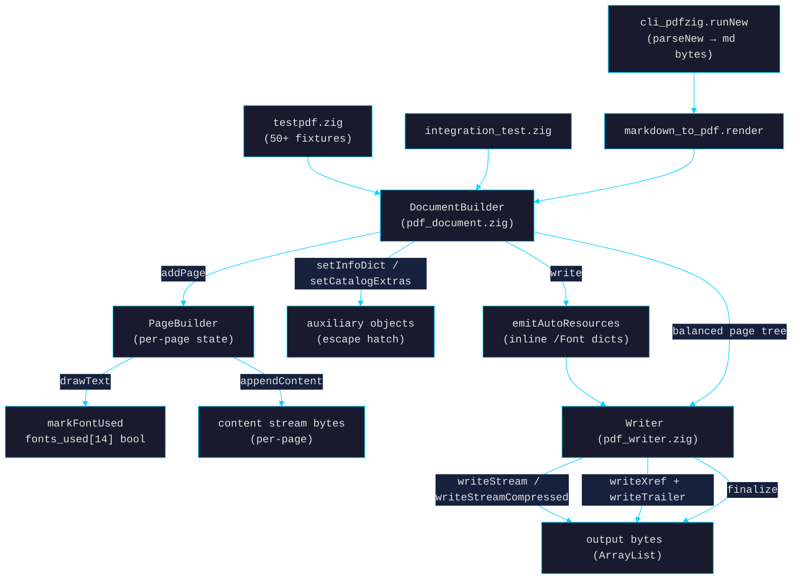

# v1.6 Tier 2 — greenfield writer call-graph plan

> **What.** v1.5 shipped Tier 1 (ASCII / WinAnsi / 14-base-fonts / hello-world).
> v1.6 closes the scope-boundary gaps the v1.5 header explicitly defers:
> font embedding (UTF-8/CJK), image XObjects, encryption, PDF/A, shared resources.
>
> **Why this doc.** Every Tier 2 PR extends `pdf_document.zig`, the same hot file.
> Without a partition plan, parallel implementation will collide on every merge.
> This doc maps current call graph → target call graph and assigns each capability
> to a disjoint-file lane so subagent implementation can run in parallel.

---

## Current call graph (Tier 1, shipped)



**Key state shape today:**

| Owner | Field | Lifetime |
|---|---|---|
| `PageBuilder` | `fonts_used: [NUM_BUILTIN_FONTS]bool` | per-page, ephemeral |
| `PageBuilder` | `content_bytes: ArrayList(u8)` | per-page |
| `DocumentBuilder` | `pages: ArrayList(*PageBuilder)` | until `write()` |
| `DocumentBuilder` | `aux_objects: ArrayList(?[]u8)` | until `write()` |
| `Writer` | `xref_offsets: ArrayList(u64)` | until `finalize()` |

**Inline-everything model.** Fonts emitted directly into each page's `/Resources` dict
during `emitAutoResources`. No catalog-level resource registry. This was right for
Tier 1 (14 base fonts × N pages) but breaks at Tier 2 (embedded font streams must
not duplicate per page).

---

## Target Tier 2 call graph

```mermaid
%%{init: {'theme': 'base', 'themeVariables': {'primaryColor': '#1a1a2e', 'primaryTextColor': '#e0e0e0', 'primaryBorderColor': '#00d4ff', 'lineColor': '#00d4ff', 'secondaryColor': '#16213e', 'tertiaryColor': '#0f3460', 'fontFamily': 'monospace'}}}%%
graph TD
    CLI["cli_pdfzig.runNew /<br/>runEmbedFont / runImage"] --> MD["markdown_to_pdf.render<br/>(W7+W8 aware)"]
    MD --> DOC

    DOC["DocumentBuilder<br/>+ shared registry"] --> REG["ResourceRegistry<br/>(NEW: pdf_resources.zig)"]
    REG --> FE["FontEntry<br/>(builtin | embedded)"]
    REG --> IE["ImageEntry"]
    REG --> CE["ColorSpaceEntry"]

    DOC -->|addPage| PB["PageBuilder<br/>(uses resource handles)"]
    PB -->|drawText handle| FE
    PB -->|drawImage handle| IE
    PB -->|beginTag/endTag MCID| ST["StructWriter<br/>(NEW: struct_writer.zig)"]

    DOC -->|embedFont path| FW["FontEmbedder<br/>(NEW: font_embedder.zig)"]
    FW -->|TrueType subset| TT["truetype.zig (NEW)"]
    FW -->|CMap generate| CMW["cmap_writer.zig (NEW)"]
    FW -->|reuse| AGL["agl.glyphNameToUnicode<br/>(reuse)"]
    FW -->|reuse| ENC["encoding tables<br/>(extracted to encoding/tables.zig)"]

    DOC -->|addImage path| IW["ImageWriter<br/>(NEW: image_writer.zig)"]
    IW -->|JPEG passthrough| JP["jpeg_meta.zig (NEW)"]
    IW -->|reuse zlib| WSC["writeStreamCompressed (existing)"]

    DOC -->|markAsPdfA| PA["PdfAEmitter<br/>(NEW: pdfa.zig)"]
    PA --> XMP["xmp_writer.zig (NEW)"]
    PA --> ICC["assets/srgb.icc (NEW)"]

    DOC -->|encrypt password,perms| ENW["EncryptWriter<br/>(NEW: encrypt_writer.zig)"]
    ENW --> CRY["crypto.zig (NEW)<br/>RC4 / AES-CBC / MD5"]
    ENW -.bidirectional.-> RDR["root.openWithPassword<br/>(parser.zig hook)"]

    DOC -->|write| W["Writer (pdf_writer.zig)<br/>+ encryption hook"]
    W --> BUF["output bytes"]

    style REG fill:#0f3460,stroke:#00ff88,stroke-width:3px
    style FW fill:#16213e,stroke:#ffaa00
    style IW fill:#16213e,stroke:#ffaa00
    style ENW fill:#16213e,stroke:#ff5577
    style PA fill:#16213e,stroke:#aa55ff
    style CRY fill:#16213e,stroke:#ff5577
```



**Architectural shift:** introduce a `ResourceRegistry` owned by `DocumentBuilder`.
Pages hold opaque handles (`FontHandle`, `ImageHandle`, `ColorSpaceHandle`); the
registry assigns object numbers and emits the canonical resource dict at write
time, with `/Parent`-inherited resources pointing to a shared `/Resources` dict on
the page-tree root. This is the foundation every Tier 2 capability lands on.

---

## File-touched matrix

Cells marked `★` are the *primary* owner of a file (most lines added/modified);
cells marked `·` are minor edits (1–10 lines). Goal: each PR has at most one `★`
overlap with another PR.

| File | W11 | W7 | W8 | W9 | W10 |
|---|:-:|:-:|:-:|:-:|:-:|
| `src/pdf_document.zig` | ★ | · | · | · | · |
| `src/pdf_writer.zig` | | | | · | |
| `src/markdown_to_pdf.zig` | | · | · | | · |
| `src/encoding.zig` (split) | | ★ | | | |
| **NEW** `src/pdf_resources.zig` | ★ | | | | |
| **NEW** `src/font_embedder.zig` | | ★ | | | |
| **NEW** `src/truetype.zig` | | ★ | | | |
| **NEW** `src/cmap_writer.zig` | | ★ | | | |
| **NEW** `src/image_writer.zig` | | | ★ | | |
| **NEW** `src/jpeg_meta.zig` | | | ★ | | |
| **NEW** `src/crypto.zig` | | | | ★ | |
| **NEW** `src/encrypt_writer.zig` | | | | ★ | |
| **NEW** `src/pdfa.zig` | | | | | ★ |
| **NEW** `src/xmp_writer.zig` | | | | | ★ |
| **NEW** `src/struct_writer.zig` | | | | | ★ |
| **NEW** `src/assets/srgb.icc` | | | | | ★ |
| `src/parser.zig` | | | | · | |
| `src/root.zig` | | | | · | |
| `src/cli_pdfzig.zig` | | · | · | · | · |
| `src/integration_test.zig` | · | · | · | · | · |

`★` collisions: **none** outside `pdf_document.zig` and `cli_pdfzig.zig`. Both are
serialized by ordering W11 first and rebasing the others on it.

---

## Dependency DAG and critical path

```mermaid
%%{init: {'theme': 'base', 'themeVariables': {'primaryColor': '#1a1a2e', 'primaryTextColor': '#e0e0e0', 'primaryBorderColor': '#00d4ff', 'lineColor': '#00d4ff', 'secondaryColor': '#16213e', 'tertiaryColor': '#0f3460', 'fontFamily': 'monospace'}}}%%
graph LR
    W11["PR-W11<br/>shared resource registry<br/>(pdf_document refactor)"]
    W7["PR-W7<br/>font embedding"]
    W8["PR-W8<br/>image XObjects"]
    W9["PR-W9<br/>encryption"]
    W10["PR-W10<br/>PDF/A + tagging"]

    W11 --> W7
    W11 --> W8
    W11 --> W10
    W7 --> W10
    W8 -.optional.-> W10
    W9 -.independent.-> W11

    style W11 fill:#0f3460,stroke:#00ff88,stroke-width:3px
    style W7 fill:#16213e,stroke:#ffaa00
    style W8 fill:#16213e,stroke:#ffaa00
    style W9 fill:#16213e,stroke:#ff5577
    style W10 fill:#16213e,stroke:#aa55ff
```



**Critical path:** `W11 → W7 → W10`. Total ~3 PR cycles end-to-end if everything
is sequential.

**Parallel-merge schedule:**

| Wave | Concurrent PRs | Rationale |
|---|---|---|
| 1 | **W11** (alone) | All others rebase off this. Single-file refactor, no new modules. |
| 2 | **W7** + **W8** + **W9** | Disjoint new modules; W11's registry is the only shared edit. |
| 3 | **W10** (alone) | Pulls font embedding (W7) for non-ASCII tag titles + alt-text. |

W9 (encryption) is technically independent of W11 — it could also run in wave 1
to maximize parallelism, but its `Writer` hook adds a low-level edit to
`pdf_writer.zig` that is cleaner to land after the registry refactor stabilizes.

---

## Subagent dispatch matrix

Each PR runs in an isolated git worktree spawned via `zig-defensive` subagent
(per CLAUDE.md global preference: "audit Zig code with rigorous defensive-
programming discipline"). Worktrees keep the main session's context clean and
let waves 2 launch in a single message.

| Lane | Agent | Worktree branch | Inputs |
|---|---|---|---|
| W11 | `zig-defensive` | `feat/w11-resource-registry` | This doc + `pdf_document.zig:124–306` |
| W7 | `zig-defensive` | `feat/w7-font-embedding` | This doc + reader-side encoding map |
| W8 | `zig-defensive` | `feat/w8-image-xobjects` | This doc + reader-side image map |
| W9 | `zig-defensive` | `feat/w9-encryption` | This doc + reader-side encryption map |
| W10 | `zig-defensive` | `feat/w10-pdfa-tagging` | This doc + structtree.zig surface |

**Wave 2 prompt skeleton** (per agent — all branched off W11's merge SHA):

> Implement PR-W7/W8/W9 per `docs/v1.6-tier2-design.md`. Touch only the files
> in your `★` row of the file matrix. Edits to `pdf_document.zig` are limited
> to the documented hook points (registry consumption only — no field
> additions). Defensive-programming gates: bounded recursion in subsetters,
> errdefer on every alloc, FailingAllocator over each entry point, fuzz seed
> derived from input bytes. Land with ≥1 round-trip integration test.

---

## PR-by-PR acceptance gates

### PR-W11 · refactor: shared resource registry (`src/pdf_resources.zig`)

> **Why.** Foundation for W7/W8/W10. Today every page inlines its own /Font dict;
> embedded fonts cannot duplicate per page.
>
> **Files-touched envelope.** `src/pdf_resources.zig` (new, ~250 LOC),
> `src/pdf_document.zig` (refactor: replace `fonts_used` with handle list),
> `src/integration_test.zig` (regression).
>
> **Acceptance gate.**
> - `ResourceRegistry` owns `fonts: ArrayList(FontEntry)`, `images: ArrayList(ImageEntry)`,
>   `color_spaces: ArrayList(ColorSpaceEntry)`. Each entry carries an object number
>   and an emit-callback.
> - `PageBuilder.useFont(handle)` and `useImage(handle)` register handles on the page.
> - `DocumentBuilder.write()` emits one shared `/Resources` dict on the page-tree
>   root; each `/Page` inherits via `/Parent` (no `/Resources` on the leaf).
> - All existing Tier-1 tests pass byte-equivalent (same pageCount, same extracted
>   text, same font refs — `/F1` etc. still resolve).
> - 1000-page stress test: file size shrinks vs Tier-1 baseline because font dict
>   is emitted once, not 1000×.
>
> **Codex gate.** `/Parent` inheritance correctness; handle stability across
> page reordering; FailingAllocator over registry growth.

### PR-W7 · feat: font embedding (TrueType subset + Type 0 CID)

> **Why.** Unlocks UTF-8, CJK, emoji. Today `drawText` silently drops bytes
> outside WinAnsi.
>
> **Files-touched envelope.** `src/font_embedder.zig`, `src/truetype.zig`,
> `src/cmap_writer.zig` (all new), `src/encoding.zig` (split: tables → new
> `src/encoding/tables.zig`), `src/pdf_document.zig` (consume registry —
> ≤30 lines), `src/integration_test.zig`.
>
> **Acceptance gate.**
> - `DocumentBuilder.embedFontFromMemory(bytes, name) -> FontHandle`
>   parses TTF/OTF, subsets to glyphs actually used, emits `/Type0` font with
>   `/CIDFontType2` descendant + ToUnicode CMap.
> - `PageBuilder.drawText(x, y, font_handle, size, utf8_text)` accepts
>   arbitrary UTF-8.
> - Round-trip: emit "東京 αβγ 🇫🇷" → re-extract via `Document.extractText` →
>   byte-identical UTF-8 (modulo the emoji which depends on font support).
> - Subset validity: extracted bytes contain only the glyphs used (size assertion
>   ≤ 30% of source font).
>
> **Codex gate.** TTF table-checksum recompute after subsetting; `/CIDToGIDMap`
> bounded by glyph count; CMap range-merging doesn't drop edge codepoints.

### PR-W8 · feat: image XObject writer (`src/image_writer.zig`)

> **Why.** Markdown `` round-trip; agent-generated charts; scanned-doc
> reassembly.
>
> **Files-touched envelope.** `src/image_writer.zig`, `src/jpeg_meta.zig` (new),
> `src/pdf_document.zig` (consume registry — ≤20 lines),
> `src/markdown_to_pdf.zig` (`` handler — ≤40 lines),
> `src/integration_test.zig`.
>
> **Acceptance gate.**
> - `DocumentBuilder.addImageJpeg(bytes) -> ImageHandle` parses JPEG SOF for
>   width/height/colorspace, emits `/XObject /Image /Filter /DCTDecode` with
>   raw bytes (passthrough — no decode-recode).
> - `DocumentBuilder.addImageRaw(bytes, w, h, colorspace, bits)` emits
>   uncompressed or `/FlateDecode` (via existing `writeStreamCompressed`).
> - `PageBuilder.drawImage(x, y, w_pt, h_pt, handle)` emits `cm` matrix + `Do`.
> - Round-trip via `--images=base64`: extract returns same JPEG bytes.
>
> **Codex gate.** SOF marker parse handles non-baseline JPEGs (SOF0/1/2/3
> dispatch); /BitsPerComponent matches actual color depth; CMYK SOF emits
> `/DeviceCMYK` not `/DeviceRGB`.

### PR-W9 · feat: encryption (RC4 + AES, V2/V4)

> **Why.** Symmetric with the reader's `Document.openWithPassword` (W9.1
> companion landing in `parser.zig` / `root.zig`). Required for any "agent
> emits confidential artifact" path.
>
> **Files-touched envelope.** `src/crypto.zig`, `src/encrypt_writer.zig` (new),
> `src/pdf_writer.zig` (encryption hook in stream/string emission — ≤30 lines),
> `src/pdf_document.zig` (`encrypt(password, perms)` — ≤15 lines),
> `src/parser.zig` + `src/root.zig` (decryption side, mirrored — ~200 LOC),
> `src/integration_test.zig`.
>
> **Acceptance gate.**
> - `DocumentBuilder.encrypt(.{ .user_password = "u", .owner_password = "o", .perms = … })`.
> - Round-trip: encrypt with V2/R3 (RC4-128) → re-open with `openWithPassword("u")` →
>   `extractText` matches plaintext build.
> - Round-trip: encrypt with V4/R4 (AES-128) → same.
> - `qpdf --check` passes on both fixtures.
>
> **Codex gate.** Constant-time password comparison; per-string vs per-stream
> key salt distinction (PDF spec §7.6.3.4); /Encrypt dict not itself encrypted.

### PR-W10 · feat: PDF/A-2b + tagged structure tree

> **Why.** Archival output; logical-structure round-trip with PR-21's reader.
> Closes the v2.0 gap from inside Tier 2.
>
> **Files-touched envelope.** `src/pdfa.zig`, `src/xmp_writer.zig`,
> `src/struct_writer.zig` (new), `src/assets/srgb.icc` (new asset),
> `src/pdf_document.zig` (`markAsPdfA`, `beginTag`/`endTag` — ≤40 lines),
> `src/markdown_to_pdf.zig` (auto-tag H1/H2/P/L — ≤60 lines),
> `src/integration_test.zig`.
>
> **Acceptance gate.**
> - `DocumentBuilder.markAsPdfA(.b2)` emits `/MarkInfo`, `/Metadata` XMP stream,
>   `/OutputIntents` array with embedded sRGB ICC, all required catalog flags.
> - `PageBuilder.beginTag(type, alt) → MCID`, `endTag()` injects BDC/EMC into
>   content stream.
> - Round-trip: build a tagged PDF/A-2b → `--struct-tree` (PR-21) returns the
>   same tree we wrote.
> - `verapdf` validation passes (or, if vendoring verapdf is too heavy,
>   `qpdf --check --warning-exit-0` + a hand-rolled minimal validator).
>
> **Codex gate.** XMP escape correctness (no `<` or `&` unescaped in metadata
> values); ICC profile is the actual sRGB v2/v4 one (not a placeholder);
> /MarkInfo /Marked true is *required* not optional.

---

## Roadmap insertion (proposed)

Append to `docs/ROADMAP.md` between current v1.5 and v2.0 sections:

```markdown
## v1.6 — greenfield PDF authoring (Tier 2: agent-grade writer)

> Closes the v1.5 scope-boundary deferrals. See `docs/v1.6-tier2-design.md`
> for the call-graph plan, file-touched matrix, and parallel-merge schedule.

- [ ] **PR-W11 · refactor: shared resource registry**
- [ ] **PR-W7 · feat: font embedding (TrueType subset + Type 0 CID)**
- [ ] **PR-W8 · feat: image XObject writer**
- [ ] **PR-W9 · feat: encryption (RC4 + AES, V2/V4)**
- [ ] **PR-W10 · feat: PDF/A-2b + tagged structure tree**
```

---

## Tags
#project/pdf-zig #kind/design #methodology/parallel-pr-dispatch
