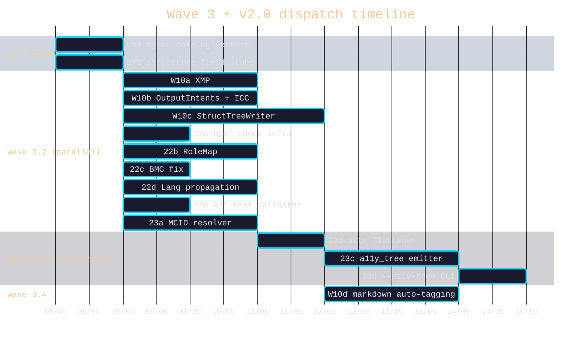

# v1.6 wave 3 + v2.0 — reader call-graph plan + sub-PR dispatch matrix

> **What.** v1.6 Tier 2 wave 1 (W11 resource registry) is in PR review (#54).
> Wave 2 (W7 font embedding, W8 image XObjects, W9 encryption) is implementing
> in parallel `zig-defensive` worktrees. This doc plans **wave 3** (W10 PDF/A
> + tagging) and decomposes the v2.0 reader-side placeholders (PR-22 PDF/UA
> validator, PR-23 a11y-tree output) into ≤1-day sub-PRs ready for
> `/next-pr` once wave 2 lands.
>
> **Why this doc.** The four Explore audits revealed that what the roadmap
> calls "PR-W10", "PR-22", "PR-23" is actually 13 sub-PRs. Without this
> decomposition + a pre-stage strategy mirroring W11, the central files
> (`pdf_document.zig`, `structtree.zig`, `markdown_to_pdf.zig`,
> `cli_pdfzig.zig`) become merge-conflict hotspots.

---

## Current reader call graph

```mermaid
%%{init: {'theme': 'base', 'themeVariables': {'primaryColor': '#1a1a2e', 'primaryTextColor': '#e0e0e0', 'primaryBorderColor': '#00d4ff', 'lineColor': '#00d4ff', 'secondaryColor': '#16213e', 'tertiaryColor': '#0f3460', 'fontFamily': 'monospace'}}}%%
graph TD
    OPEN["Document.openFromMemory<br/>(root.zig:289)"] --> XREF["xref.parseXRef<br/>(xref.zig:69)"]
    OPEN --> PT["pagetree.buildPageTree<br/>(pagetree.zig:388)"]
    OPEN --> EFP["ensurePageFonts<br/>(root.zig:356)"]
    EFP --> ENC["encoding.parseFontEncoding<br/>(encoding.zig:417)"]

    EXTXT["Document.extractText<br/>(root.zig:515)"] --> GETC["pagetree.getPageContents<br/>(pagetree.zig:587)"]
    GETC --> RESREF["pagetree.resolveRef<br/>(pagetree.zig:52)"]
    GETC --> DECOMP["decompress.decompressStream<br/>(decompress.zig)"]
    EXTXT --> ECS["extractContentStream<br/>(root.zig:2619)"]
    ECS --> LEX["interpreter.ContentLexer<br/>(interpreter.zig:518)"]
    ECS --> DECTXT["FontEncoding.decodeText<br/>(encoding.zig:248)"]
    EXTXT --> BIDI["bidi.processLines<br/>(bidi.zig:519)"]

    EXTMD["Document.extractMarkdown<br/>(root.zig:968)"] --> EXTBND["extractTextWithBounds<br/>(root.zig:589)"]
    EXTBND --> ECS
    EXTMD --> MDR["markdown.MarkdownRenderer.render<br/>(markdown.zig:179)"]
    MDR --> LAYOUT["layout.analyzeLayout"]

    GETST["Document.getStructTree<br/>(root.zig:672)"] --> PARSEST["structtree.parseStructTree<br/>(structtree.zig:196)"]
    PARSEST --> RESREF

    style OPEN fill:#0f3460,stroke:#00ff88,stroke-width:2px
    style EXTXT fill:#0f3460,stroke:#00ff88,stroke-width:2px
    style EXTMD fill:#0f3460,stroke:#00ff88,stroke-width:2px
    style GETST fill:#0f3460,stroke:#00ff88,stroke-width:2px
```

**Five reader layers** (each a clean seam — sub-PRs can target one layer):

| Layer | Module | Responsibility |
|---|---|---|
| **Object** | `xref.zig`, `parser.zig`, `pagetree.zig::resolveRef` | xref + indirect-object resolution |
| **Token** | `interpreter.zig::ContentLexer` (line 518) | Content-stream tokenizer (operators + operands) |
| **Interpreter** | `root.zig::extractContentStream` (line 2619) | PostScript-like operator dispatch (Tf, Tj, TJ, Tm, BDC, EMC) |
| **Encoding** | `encoding.zig::FontEncoding.decodeText` (line 248) | Glyph code → Unicode (CFF, ToUnicode CMap) |
| **Post-processing** | `bidi.zig`, `markdown.zig`, `layout.zig` | UAX #9 reorder + Markdown layout |

**Decryption hook point** (for W9, already dispatched): `pagetree.zig::getStreamData` at line 600–635. Decrypt sits *before* decompress.

---

## Wave 3 + v2.0 PR map (decomposed)

```mermaid
%%{init: {'theme': 'base', 'themeVariables': {'primaryColor': '#1a1a2e', 'primaryTextColor': '#e0e0e0', 'primaryBorderColor': '#00d4ff', 'lineColor': '#00d4ff', 'secondaryColor': '#16213e', 'tertiaryColor': '#0f3460', 'fontFamily': 'monospace'}}}%%
graph TD
    W11["✓ W11<br/>resource registry"] --> WX1["WX1 (pre-stage)<br/>typed catalog setters<br/>+ PageBuilder.beginTag/endTag"]

    WX1 --> W10A["W10a<br/>XMP + /Metadata stream"]
    WX1 --> W10B["W10b<br/>OutputIntents + sRGB ICC"]
    WX1 --> W10C["W10c<br/>StructTreeWriter"]

    W10C --> W10D["W10d<br/>markdown auto-tagging<br/>(BDC/EMC injection)"]
    W7["W7 (in flight)<br/>font embedding"] -.optional non-ASCII alt.-> W10D

    W11 --> SX1["SX1 (pre-stage)<br/>structtree.zig field stubs<br/>(lang, resolved_role, mcid_text)"]

    SX1 --> P22A["22a (infra)<br/>qpdf --check CI gate"]
    SX1 --> P22B["22b<br/>/RoleMap parser + emitter"]
    SX1 --> P22C["22c<br/>BMC tag-only fix"]
    SX1 --> P22D["22d<br/>/Lang propagation"]
    SX1 --> P22E["22e<br/>Alt-text validator"]

    SX1 --> P23A["23a<br/>MCID → text resolver"]
    P23A --> P23B["23b<br/>inherited-attr flattener"]
    P23B --> P23C["23c<br/>a11y_tree NDJSON emitter"]
    P23C --> P23D["23d<br/>--a11y-tree CLI flag"]

    style W11 fill:#0f3460,stroke:#00ff88,stroke-width:2px
    style W7 fill:#16213e,stroke:#888
    style WX1 fill:#0f3460,stroke:#00ff88,stroke-width:3px
    style SX1 fill:#0f3460,stroke:#00ff88,stroke-width:3px
    style W10A fill:#16213e,stroke:#aa55ff
    style W10B fill:#16213e,stroke:#aa55ff
    style W10C fill:#16213e,stroke:#aa55ff
    style W10D fill:#16213e,stroke:#aa55ff
    style P22A fill:#16213e,stroke:#ff5577
    style P22B fill:#16213e,stroke:#ff5577
    style P22C fill:#16213e,stroke:#ff5577
    style P22D fill:#16213e,stroke:#ff5577
    style P22E fill:#16213e,stroke:#ff5577
    style P23A fill:#16213e,stroke:#ffaa00
    style P23B fill:#16213e,stroke:#ffaa00
    style P23C fill:#16213e,stroke:#ffaa00
    style P23D fill:#16213e,stroke:#ffaa00
```

**Two pre-stage PRs (W11 pattern, applied recursively):**

- **WX1** — types/setters on `pdf_document.zig` (≤120 lines). Adds typed catalog setters (`markAsTagged`, `setLang`, `markAsPdfA`), pre-stages `xmp_metadata_obj`, `output_intents`, `struct_tree_root` fields, and adds `PageBuilder.beginTag(type, alt) → MCID` / `endTag()` that just inject BDC/EMC into the content stream. **No emission yet.** This unblocks W10a/b/c/d to land in parallel against disjoint files.

- **SX1** — placeholders on `structtree.zig` (≤80 lines). Adds nullable fields to `StructElement` (`lang: ?[]const u8`, `resolved_role: ?[]const u8`, `mcid_text: ?[]const u8` — populated only when accessors run). Adds public-API stubs `parseRoleMap()`, `propagateLang()`, `validateAltText()` that no-op today. This unblocks 22a/b/c/d/e + 23a/b to land in parallel against disjoint fields.

---

## File-touched matrix (★ = primary owner)

| File | WX1 | W10a | W10b | W10c | W10d | SX1 | 22a | 22b | 22c | 22d | 22e | 23a | 23b | 23c | 23d |
|---|:-:|:-:|:-:|:-:|:-:|:-:|:-:|:-:|:-:|:-:|:-:|:-:|:-:|:-:|:-:|
| `src/pdf_document.zig` | ★ | · | · | · | · | | | | | | | | | | |
| **NEW** `src/xmp_writer.zig` | | ★ | | | | | | | | | | | | | |
| **NEW** `src/assets/srgb.icc` | | | ★ | | | | | | | | | | | | |
| **NEW** `src/struct_writer.zig` | | | | ★ | | | | | | | | | | | |
| `src/markdown_to_pdf.zig` | | | | | ★ | | | | | | | | | | |
| `src/structtree.zig` | | | | | | ★ | | · | · | · | · | · | · | | |
| **NEW** `audit/qpdf_check.py` | | | | | | | ★ | | | | | | | | |
| `.github/workflows/qpdf-check.yml` | | | | | | | ★ | | | | | | | | |
| `src/interpreter.zig` | | | | | | | | | ★ | | | | | | |
| **NEW** `src/mcid_resolver.zig` | | | | | | | | | | | | ★ | | | |
| **NEW** `src/attr_flattener.zig` | | | | | | | | | | | | | ★ | | |
| **NEW** `src/a11y_emitter.zig` | | | | | | | | | | | | | | ★ | |
| `src/cli_pdfzig.zig` | | | | | | | | | | | | | | · | ★ |
| `src/stream.zig` | | | | | | | | | | | | | | · | |
| `src/integration_test.zig` | · | · | · | · | · | · | · | · | · | · | · | · | · | · | · |

**Star-cell collisions:** zero outside `pdf_document.zig` (WX1 is the only owner) and `structtree.zig` (SX1 is the only owner). Every wave-3 implementation PR has a **dedicated `★` file** plus minor edits.

---

## Dispatch matrix (sub-waves)

The 13 sub-PRs split into five sub-waves. Sub-waves serialize; within a sub-wave, all PRs dispatch in parallel.

| Sub-wave | Sub-PRs | Concurrency | Gate |
|---|---|---|---|
| **3.1** (pre-stage) | WX1, SX1 | Both parallel — disjoint files | W11 merged + wave 2 stable |
| **3.2** (writer + reader fan-out) | W10a, W10b, W10c, 22a, 22b, 22c, 22d, 22e, 23a | **9 parallel** — each owns a `★` file | 3.1 merged |
| **3.3** (a11y chain) | 23b → 23c → 23d | Sequential — each builds on the last | 23a merged |
| **3.4** (markdown auto-tagging) | W10d | Alone — needs W10c's MCID numbering + W7's font embedding for non-ASCII alt text | 3.2 + W7 merged |

**Peak parallelism: 9 simultaneous `zig-defensive` worktree agents** in wave 3.2. That stresses the harness (each worktree builds a separate `.zig-cache/`). Acceptable — same memory budget the four Explore agents just consumed.

---

## PR-by-PR specifications

### PR-WX1 · refactor: typed catalog setters + page tagging hooks

> **Why.** Foundation for W10a/b/c/d. Same shape as W11 — pre-stage the hooks so parallel implementations don't all fight over `pdf_document.zig`.
>
> **Files-touched envelope.** `src/pdf_document.zig` (~120 lines), `src/integration_test.zig` (~30 lines).
>
> **Acceptance gate.**
> - `DocumentBuilder.markAsTagged()`, `setLang(bcp47)`, `markAsPdfA(level)` setters compile and store flags on the builder. **No emission.** Calling `.write()` after these still produces the same Tier-1-equivalent bytes.
> - `PageBuilder.beginTag(type, alt) → MCID` writes `/{type} <</MCID N>> BDC` into the content stream and returns the MCID; `endTag()` writes `EMC`. The MCID counter is per-document.
> - Existing tests pass byte-equivalent.
>
> **Codex gate.** MCID counter is monotonic across pages; `endTag` without a matching `beginTag` is a clean error (not a panic).

### PR-SX1 · refactor: structtree field stubs

> **Why.** Foundation for 22b/c/d/e + 23a/b. Pre-stages nullable fields and stub APIs so 6 parallel sub-PRs each fill in one slot.
>
> **Files-touched envelope.** `src/structtree.zig` (~80 lines), `src/integration_test.zig` (~10 lines).
>
> **Acceptance gate.**
> - `StructElement` gains `lang: ?[]const u8`, `resolved_role: ?[]const u8`, `mcid_text: ?[]const u8` — all initialized to null today.
> - Public stub APIs: `parseRoleMap`, `propagateLang`, `validateAltText`, `resolveMcidText` — each takes its expected signature, returns successful no-op (or null) today.
> - All existing tests pass byte-identical.
>
> **Codex gate.** Field additions don't break the JSON emission backwards-compat (today's `--struct-tree` output unchanged).

### PR-W10a · feat: XMP metadata stream

- **Files:** `src/xmp_writer.zig` (new ~200), `src/pdf_document.zig` (≤15 lines).
- **Gate:** Emits valid XMP with `pdfaVersion`/`pdfaConformance` markers; `/Metadata` stream referenced from catalog. XMP escape correctness (no unescaped `&`, `<`).

### PR-W10b · feat: OutputIntents + sRGB ICC

- **Files:** `src/assets/srgb.icc` (new 4 KB binary), `src/pdf_document.zig` (≤15 lines).
- **Gate:** `/OutputIntents` array emitted with one entry pointing to the embedded ICC stream; `qpdf --check` passes (gated on PR-22a's harness).

### PR-W10c · feat: structure-tree writer

- **Files:** `src/struct_writer.zig` (new ~300), `src/pdf_document.zig` (≤25 lines).
- **Gate:** `StructTreeBuilder` constructs `/StructTreeRoot` + `/K` arrays; round-trip via PR-21's `--struct-tree` returns the same shape that was built. Bounded recursion on tree serialization.

### PR-W10d · feat: markdown auto-tagging (BDC/EMC injection)

- **Files:** `src/markdown_to_pdf.zig` (≤60 lines).
- **Gate:** Each H1/H2/H3/P/L block wrapped in `beginTag/endTag`. Round-trip: render markdown → emit tagged PDF → `--struct-tree` returns matching tree. Single-`/P`-per-paragraph (option A from W10 audit), not per-line.

### PR-22a · infra: qpdf --check CI harness

- **Files:** `audit/qpdf_check.py` (new), `.github/workflows/qpdf-check.yml` (new), `build.zig` (≤10 lines).
- **Gate:** New CI job runs `qpdf --check` on every fixture in `tests/fixtures/` and reports pass/fail. Baseline: ≥80% of fixtures pass (current state — most do). The check becomes a gate after PR-W10b lands.

### PR-22b · feat: /RoleMap parser + writer emission

- **Files:** `src/structtree.zig` (≤40 lines — fills SX1's `parseRoleMap` stub).
- **Gate:** Reader resolves custom role names to standard PDF/UA structure types via `/RoleMap`. Round-trip on a fixture with `<<...RoleMap << /CustomP /P >> >>`.

### PR-22c · fix: BMC tag-only marked content

- **Files:** `src/interpreter.zig` (≤30 lines), `src/structtree.zig` (≤10 lines).
- **Gate:** Reader handles `/Tag BMC ... EMC` without requiring an MCID property dict. Existing PDF fixture with bare BMC parses cleanly.

### PR-22d · feat: /Lang propagation

- **Files:** `src/structtree.zig` (≤50 lines — fills SX1's `propagateLang` stub).
- **Gate:** Reader walks tree, fills `lang` on each element from inherited `/Lang`. Emits `lang` in `--struct-tree` JSON. Round-trip on a fixture with catalog-level `/Lang (en-US)` and a child `/Lang (fr-FR)` propagating correctly.

### PR-22e · feat: alt-text validator

- **Files:** `src/structtree.zig` (≤30 lines — fills SX1's `validateAltText` stub).
- **Gate:** Validator returns `error.MissingAltTextOnFigure` if a `/Figure` element lacks `/Alt`. Hooked into PR-W10c's struct-writer (writer-side enforcement).

### PR-23a · feat: MCID → text resolver

- **Files:** `src/mcid_resolver.zig` (new ~150), `src/structtree.zig` (≤20 lines).
- **Gate:** Given a `Document` + a `MarkedContentRef`, returns the text bytes the MCID brackets. Reuses `MarkedContentExtractor` (line 434 in structtree.zig). Bounded by content-stream size.

### PR-23b · feat: inherited-attribute flattener

- **Files:** `src/attr_flattener.zig` (new ~80), `src/structtree.zig` (≤10 lines).
- **Gate:** Walks the struct tree, returns each leaf with `/Lang`, `/Alt`, `/ActualText` flattened from ancestors (no parent walk needed downstream). Depends on PR-22d.

### PR-23c · feat: a11y_tree NDJSON emitter

- **Files:** `src/a11y_emitter.zig` (new ~120), `src/stream.zig` (≤20 lines new `RecordKind.a11y_tree`).
- **Gate:** Emits NDJSON record with reading-order linearization, MCID → text resolution, flattened inherited attrs. Schema documented in stream.zig comments.

### PR-23d · feat: --a11y-tree CLI flag

- **Files:** `src/cli_pdfzig.zig` (≤30 lines), `src/integration_test.zig` (≤40 lines).
- **Gate:** `pdf.zig extract --a11y-tree foo.pdf` emits the NDJSON record. Round-trip integration test on `tests/fixtures/tagged_simple.pdf`.

---

## Roadmap insertion (proposed)

Append to `docs/ROADMAP.md`. The v1.6 section grows to include WX1 + W10a–d in place of the current "PR-W10" line; v2.0 placeholders get replaced by the SX1-gated sub-PRs.

---

## Risks + mitigations

| Risk | Mitigation |
|---|---|
| WX1 + SX1 add new fields → all existing tests must still pass byte-equivalent. | Same approach as W11: structural assertions, not byte-equivalence. WX1 emission is gated behind explicit setters — no opt-in = no behaviour change. |
| 9 parallel zig-defensive worktrees in wave 3.2 stress disk I/O (each builds `.zig-cache/`). | Acceptable — observed under the four wave-2-style Explore agents. If it becomes a problem, split 3.2 into 3.2a (writer 4) + 3.2b (reader 5). |
| W10d depends on W7 for non-ASCII alt-text in tags, but W7 may slip if TTF subsetting is harder than estimated. | W10d's acceptance gate uses ASCII alt-text only. Non-ASCII alt-text becomes a follow-up PR-W10d.1 once W7 lands. |
| PR-22a (qpdf-check CI) may fail today's fixtures. | Baseline as "≥80% pass". The check escalates to a hard gate only after PR-W10b lands (which fixes the most likely current failure: missing /OutputIntents on emitted PDFs). |
| Wave 2 (W7/W8/W9) introduces unanticipated changes to `pdf_document.zig` that conflict with WX1. | WX1 dispatches **after** wave 2 merges. The design above lists the line-budget for WX1 (~120 lines); even if wave 2's `pdf_document.zig` edits land first, WX1's edits live in a different region (catalog setters vs page resource registration). |

---

## Tags
#project/pdf-zig #kind/design #methodology/parallel-pr-dispatch #scope/wave-3 #scope/v2.0
